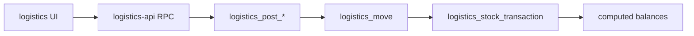
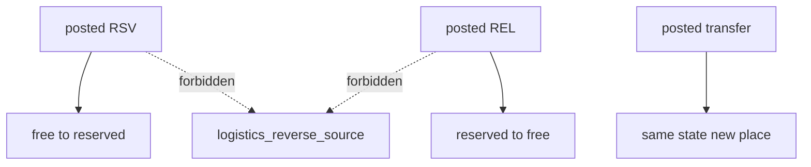

# Architecture Spine — reservation-unreservation

## Design Paradigm

Append-only stock ledger. Documents post once; balances are `sum(quantity)` of `logistics_stock_transaction`. Compensating effect is a new posted document, not a reverse of the original source.





## Invariants & Rules

### AD-1 — Posted RSV/REL are irreversible [ADOPTED intent]

- **Binds:** CAP-5, `logistics_cancel_document`, reservation and release UI
- **Prevents:** One builder keeps storno-cancel while another treats posted RSV as history-only
- **Rule:** `logistics_cancel_document` must reject `p_kind` `reservation` and `reservation_release`. Those sources must not call `logistics_reverse_source`. Posted rows stay `posted`.

### AD-2 — Release addresses the balance key, not the RSV document [ADOPTED]

- **Binds:** CAP-2, `logistics_reservation_release_line`
- **Prevents:** A builder adding `reservation_id` while another releases by current reserved qty
- **Rule:** REL lines carry place + `customer_order_id` / `customer_order_line_id` + qty. No FK or UI field to `logistics_reservation`.

### AD-3 — Only posting RPCs mutate stock [ADOPTED]

- **Binds:** CAP-1, CAP-2, CAP-3, CAP-4
- **Prevents:** Client-side ledger inserts or dual write paths
- **Rule:** UI and `logistics-api.ts` call existing `logistics_post_*` / transfer / shipment RPCs. Browser never inserts `logistics_stock_transaction`.

### AD-4 — Transfer preserves stock type and order [ADOPTED]

- **Binds:** CAP-3
- **Prevents:** Transfer undo being implemented as RSV cancel
- **Rule:** Send/complete keep `stock_state` and order fields. Transfer cancel (if still allowed) must not change RSV/REL status or reverse RSV/REL sources.

### AD-5 — Change lives in logistics feature + one migration

- **Binds:** all
- **Prevents:** Split of cancel policy between app-only guard and RPC
- **Rule:** Server reject is the source of truth (new `supabase/migrations/logistics_*`). UI removes cancel actions for RSV/REL. Docs in `docs/features/logistics.md` match.

## Consistency Conventions

| Concern | Convention |
| --- | --- |
| Naming | RSV / REL prefixes via `formatLogisticsCode`; English UI labels |
| Data | bigint string ids on client; stock key as in operational-model.md |
| State | RSV/REL: `draft` then `posted`. Historical `cancelled` rows are archive-only |
| Errors | RPC raises; UI toasts the error. No silent no-op cancel |
| Auth | Oryx demo Supabase anon, open RLS on demo tables |

## Stack

| Name | Version |
| --- | --- |
| Next.js | 16.2 |
| TypeScript | 5.x |
| @supabase/supabase-js | 2.116 |
| Vitest | project `npm run test` |
| PostgreSQL | Oryx demo compose `oryx-supabase-bb1dnn` |

## Structural Seed

```text
src/features/logistics/
  reservations-page.tsx
  flow-documents-pages.tsx
  logistics-api.ts
  logistics-rules.ts
supabase/migrations/
  20260917XXXXXX_logistics_reservation_no_storno.sql
docs/features/logistics.md
tests/unit/logistics-*.test.ts
```

## Capability → Architecture Map

| Capability / Area | Lives in | Governed by |
| --- | --- | --- |
| CAP-1 post RSV | `logistics_post_reservation`, ReservationForm | AD-3 |
| CAP-2 post REL | `logistics_post_release`, ReleaseForm | AD-2, AD-3 |
| CAP-3 transfer type | `logistics_send_transfer`, `logistics_complete_transfer` | AD-4 |
| CAP-4 shipment leftover | `logistics_post_shipment`, REL qty from balances | AD-3 |
| CAP-5 no storno | `logistics_cancel_document`, RSV/REL pages | AD-1, AD-5 |

## Deferred

- Cancel/storno of transfer, shipment, return, output — other document families.
- Whether historical cancelled RSV/REL rows are purged — archive stay is enough.
- Server tests of RPC — add if a live probe is available; unit tests cover UI/rules first.
