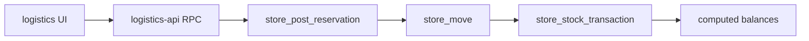
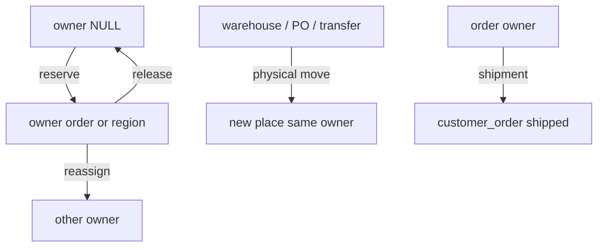

# Architecture Spine — order-and-region-reservations

## Design Paradigm

Append-only stock ledger. Documents post once; balances are `sum(quantity)` of `store_stock_transaction`. Owner reclassification is a new posted Reservation, not an in-place update of a claim column.





## Inherited Invariants

| Inherited | From parent | Binds here |
| --- | --- | --- |
| AD-1 posted RSV irreversible | architecture-oryx-2026-09-17 | `store_cancel_document('reservation')` still rejects |
| AD-3 only posting RPCs mutate stock | architecture-oryx-2026-09-17 | Browser never inserts ledger rows |
| AD-5 change lives in logistics + one migration | architecture-oryx-2026-09-17 | One additive `store_*` migration owns the cutover |

Parent AD-2 (REL addresses balance key, not RSV document) is superseded: there is no REL; release is Reservation with destination Free addressing the owner balance key.

## Invariants & Rules

### AD-1 — Generic owner pair is the only claim [ADOPTED]

- **Binds:** CAP-7, ledger, balances, allocations
- **Prevents:** One builder keeps `customer_order_line_id` on shipment while another uses owner
- **Rule:** `store_stock_transaction`, balance view, reservation header/lines, transfer allocations, output allocations store `owner_type` + `owner_id` only. No claim `customer_order_id` / `customer_order_line_id` columns.

### AD-2 — Reservation posting is the only owner reclassification [ADOPTED]

- **Binds:** CAP-1, CAP-2, CAP-3, CAP-4
- **Prevents:** A second RPC or client write that edits owner on existing balances
- **Rule:** `store_post_reservation` reads destination from header and source from each line. No `operation` column. Direction is derived. One destination per document.

### AD-3 — Polymorphic integrity is CHECK + trigger [ADOPTED]

- **Binds:** CAP-7, `store_region`, customer orders
- **Prevents:** A builder adding an owner registry table or app-only validation
- **Rule:** Pair is both NULL or both set; type ∈ `{order, region}`. Trigger verifies `order` → `store_customer_order` and `region` → `store_region`. `store_region` is a catalog entity, not a generic owner registry.

### AD-4 — Physical move preserves owner; shipment is order-only [ADOPTED]

- **Binds:** CAP-6
- **Prevents:** Transfer silently converting region reserve to free or shipment consuming region
- **Rule:** `store_send_transfer` / `store_complete_transfer` / production moves copy owner. `store_post_shipment` consumes only `owner_type=order` matching the shipment order.

### AD-5 — Order uniqueness and aggregation by product [ADOPTED]

- **Binds:** CAP-5
- **Prevents:** Reservation line pointing at an ambiguous order line
- **Rule:** Unique `(order_id, product_id)` on `store_customer_order_line`. Demand, reserve, ship checks aggregate by `owner order + product`.

### AD-6 — stock_state stays aligned with owner [ADOPTED]

- **Binds:** CAP-1, CAP-2, balances UI
- **Prevents:** `stock_state=reserved` with NULL owner or `free` with an owner
- **Rule:** `free` iff owner NULL; `reserved` iff owner set on warehouse / production_order_line / transfer; `shipped` only on `customer_order` with `owner_type=order`.

## Consistency Conventions

| Concern | Convention |
| --- | --- |
| Naming | `ownerType` / `ownerId` in TS; `owner_type` / `owner_id` in SQL. Codes `RSV-n`, `REG-n` |
| Data | bigint string ids on client; NULL owner = Free |
| State | Reservation `draft` then `posted`. Derived filter All/Reserve/Release/Reassign |
| Errors | RPC raises; UI toasts. No silent no-op |
| Auth | Oryx demo Supabase anon, open RLS |
| UI language | English on new and rewritten surfaces |

## Stack

| Name | Version |
| --- | --- |
| Next.js | 16.2 |
| TypeScript | 5.x |
| @supabase/supabase-js | 2.116 |
| Vitest | project `npm run test` |
| PostgreSQL | Oryx demo compose `oryx-supabase-bb1dnn` |

## Structural Seed

```text
supabase/migrations/20260919010000_store_owner_reservations.sql
src/features/logistics/
  logistics-types.ts
  logistics-api.ts
  logistics-balances.ts
  logistics-availability.ts
  logistics-rules.ts
  logistics-forms.tsx
  reservations-page.tsx
  stock-page.tsx
  regions-page.tsx
scripts/seed-logistics.mjs
docs/features/logistics.md
tests/unit/logistics-*.test.ts
```

## Capability → Architecture Map

| Capability / Area | Lives in | Governed by |
| --- | --- | --- |
| CAP-1 reserve | `store_post_reservation`, ReservationForm | AD-2, AD-6 |
| CAP-2 release | same RPC, destination NULL | AD-2 |
| CAP-3 reassign | same RPC, both owners set | AD-2 |
| CAP-4 mixed sources | ReservationLine unique + form | AD-2 |
| CAP-5 order+product | unique index, availability helpers | AD-5 |
| CAP-6 move / ship | transfer + shipment RPCs | AD-4 |
| CAP-7 generic owner | migration + types + seed | AD-1, AD-3 |

## Deferred

- Mapping `store_region` to pricelist demo region slugs.
- Additional owner types.
- Server integration tests beyond live probe + unit coverage of rules/RPC strings.
- Historical cancelled archive purge.
