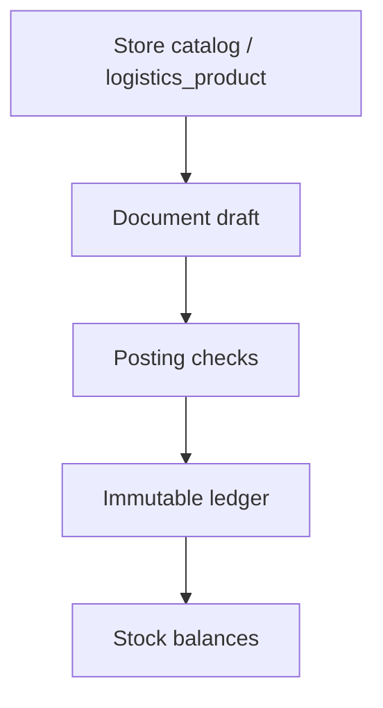

# Logistics (`/store/logistics`)

Демо-модуль **заказов и логистики** внутри раздела **Store**: документы, движение товара и расчёт остатков из неизменяемого журнала. Товары — тот же список, что и каталог Store/PIM (`logistics_product` в demo Supabase). Данные в self-hosted Supabase проекта Oryx, без логина (`anon` + открытый RLS). Схема соответствует канвасу Orders Logistics Schema.

## Маршруты

| URL | Назначение |
|-----|------------|
| `/store/pim/products` | Единый список товаров (каталог Store). Логистика больше не держит отдельный каталог |
| `/store/pim/products/[id]` | Карточка товара: фото/цена каталога + остатки, заводы и связанные документы |
| `/store/logistics/stock` | Остатки по товарам: итог и разбивка по складам и типам мест |
| `/store/logistics/ledger` | Журнал товарных транзакций |
| `/store/logistics/customer-orders` | Заказы |
| `/store/logistics/reservations` | Reservations (reserve and release) |
| `/store/logistics/shipments` | Отгрузка |
| `/store/logistics/returns` | Возврат отгрузки |
| `/store/logistics/production-orders` | Заказы на производство |
| `/store/logistics/outputs` | Выпуск |
| `/store/logistics/transfers` | Перемещение |
| `/store/logistics/warehouses` | Склады (создание из шапки списка; в списке видны автокод `WH-n` и название) |
| `/store/logistics/warehouses/[id]` | Карточка склада: автокод, название, остатки, связанные документы; правится только название |
| `/store/logistics/manufacturers` | Заводы (создание сразу со складом; в списке видны автокод `PLT-n` и название) |
| `/store/logistics/manufacturers/[id]` | Карточка завода: автокод, название, склад, остатки, заказы на производство; правится только название |
| `/store/settings` | Настройки Store: префиксы документов (`OMS`, `PO`, `RSV`, …) |

Старые URL `/logistics/...` редиректят сюда. `/logistics/products` и `/store/logistics/products` ведут в `/store/pim/products`.

Пункт **Logistics** больше не в левом рейле — он в aside **Store**, рядом с Products. Меню: операции (остатки, заказы, заказы на производство, выпуски, перемещения, отгрузки, возвраты), справочники (склады, заводы), технические (бронирования с фильтром Reserve/Release, журнал). `src/features/logistics/logistics-nav.ts`. Legacy `/store/logistics/releases` redirects to Reservations filtered to release.

## Что видит пользователь

Список — белая toolbar-карточка на `bg-muted/30`, фильтры внутри, таблица ниже. См. [list-page-toolbar.md](../conventions/ui/list-page-toolbar.md). Остатки — одна строка на товар: всего и итог по типу места, без перечисления складов, производств, перемещений и заказов. В тулбаре — чипы состояния, поиск по названию/артикулу, селект места (склад или тип) и селект заказа. Фильтры пишутся в URL (`state`, `place`, `q`, `order`). Пустые колонки типов скрываются, когда место сужено. С карточек товара, склада и заказа есть ссылка в отфильтрованные остатки. Конкретные места смотрят в карточке товара. Завод и склад везде, кроме своего списка и своей карточки, показываются только автокодом (`PLT-7`, `WH-1`); полное название — на страницах справочника, где его можно править. Код не редактируется: это префикс + целочисленный id. Склад завода — отдельная сущность (`WH-n`), не копия кода завода.

Большинство документов проходят **Draft → Posted**; у части семейств отмена ещё пишет сторно журнала. **Reservation** (reserve и release) после проведения неизменяема: нет cancelled и нет сторно. Освободить резерв можно только новым документом с `operation=release`. Префикс всегда `RSV-n`.

Заказ сам остатки не меняет — только потребность и потолок: заказано / занято / отгружено / открыто к брони. **Бронь — единственный claim:** свободное становится занятым заказом. Один документ Reservation = один заказ + одно место + одна операция (`reserve` или `release`); строки задают положительные количества по строкам заказа. Место в заголовке: склад, строка заказа на производство или перемещение в пути.

У заказа есть необязательная дата **ожидаемого окончания** (`expected_end_on`): её ставит менеджер вручную, она не считается из документов и правится в любой момент. Заказ на производство, выпуск и перемещение несут свою такую же дату. В карточке заказа у связанных заказов на производство, выпусков и перемещений дата видна рядом со статусом. Отгрузки, брони, снятия и возвраты срока не имеют.

Заказ на производство — место и план, не назначение клиентского заказа. После создания количество сразу в производственном наличии; статусы (черновик / план / в работе / готов) — только workflow. Заказ на производство виден в заказе клиента, если с его строк бронировали этот заказ (по истории RSV, не только по текущему остатку). Выпуск: **Planned → Done** (плюс Cancelled). Остатки двигаются только при Done. «Под заказ» на выпуске — сахар: сначала проводится обычный RSV, потом выпуск. Тихой брони без документа нет.

Одна отгрузка = один заказ + один склад, только из занятого. Перемещение не назначает заказ: при отправке можно указать, какой уже занятый кусок снимаем со склада; свободное едет свободным. Пока статус **sent**, место `transfer` ведёт себя как склад: свободное в пути можно забронировать обычным RSV. Доставка кладёт на склад назначения текущие остатки с этого места. **draft → sent → delivered**, без частичных приёмок.

Карточка заказа — хаб исполнения. Сверху заказы на производство, выпуски, перемещения и отгрузки; бронирования (reserve/release) и возвраты — тише, вторым рядом. Из блоков: новый заказ на производство сразу с бронью, бронь на существующем PO, выпуск, перемещение занятого, бронь в пути, отгрузка.

## Поток данных



Проведение и проверка доступности выполняются одной RPC-транзакцией Postgres (`logistics_post_*`, `logistics_send_transfer`, `logistics_complete_transfer`, …). Повторный вызов не создаёт новых движений (идемпотентность + статус).

## Модель

Минимальные сущности канваса: **общий товар** (`logistics_product`, тот же integer id что в каталоге Store), производитель (ровно один склад), склад, заказ, заказ на производство, единое бронирование Reservation (reserve|release), перемещение, отгрузка, выпуск, возврат, товарная транзакция.

Все таблицы логистики имеют sequential `bigint identity` PK (журнал — `transaction_id`). Отображаемый код **не хранится**: `formatLogisticsCode` / `public.logistics_code(kind, id)` → `PREFIX-id`. Дефолты в `LOGISTICS_CODE_PREFIXES`; живые значения — `logistics_setting.code_prefixes`, правятся на `/store/settings`:

| Kind | Prefix | Example |
|------|--------|---------|
| product | PRD | PRD-1 |
| manufacturer | PLT | PLT-7 |
| warehouse | WH | WH-1 |
| customer order | OMS | OMS-12 |
| production order | PO | PO-1 |
| reservation (reserve or release) | RSV | RSV-1 |
| transfer | TR | TR-1 |
| shipment | SHP | SHP-1 |
| output | OUT | OUT-1 |
| return | RET | RET-1 |
| lines / allocations / product–plant / ledger / setting | COL POL RSVL TRL TRA SHL OUTL OUA RETL PM TXN SET | COL-1 |

URL используют integer id (`/store/logistics/customer-orders/12`, `/store/pim/products/1`). Старые строковые id (`p-6365`, `po-e004c202-…`, `OMS-120`, `SH-4`) сняты.

Состояния остатка: свободно / занято заказом / отгружено. Места: склад, строка производства, перемещение, заказ.

Каталог читает те же строки: цены и фото пишутся в `dealer_price` / `retail_price` / `image_url` при `npm run seed:logistics` из снимка Корпортала (`media` collection `photos`). В `image_url` кладётся Spatie **medium** (`/s3/media/{YYYY}/{MM}/{DD}/{HH}/{id}/conversions/{stem}-medium.webp`); если medium нет — `small`, затем `big`; оригинал (`/{id}/{file}`) только когда конверсий нет. Если фото нет — muted placeholder, не Unsplash. Если цены в снимке нет, UI считает демо-цену на клиенте.

## Бэкенд

- Клиент: `src/lib/supabase/client.ts`
- Пути: `src/features/logistics/logistics-paths.ts`
- Каталог из той же таблицы: `src/features/store/store-catalog-from-logistics.ts`
- Миграции: `supabase/migrations/20260916200000_logistics.sql` и последующие `logistics_*`, включая integer PK `20260917230000`–`20260917230200`
- Коды: `src/features/logistics/logistics-codes.ts`, `logistics_setting.code_prefixes` (UI: `/store/settings`) и `public.logistics_code`
- Seed: `npm run seed:logistics` — remapped Korportal snapshot in `scripts/data/logistics-demo.json` (dense integer ids 1…n, no stored document codes). Equipment products, plants + plant warehouses, product↔plant links from `pim_product_variants.plant_id`, non-deleted OMS orders. Seed copies portal `image_url` / prices from that snapshot and infers category/family.
- Product–plant: Korportal stores the factory on the variant (`pim_product_variants.plant_id` → `pim_plants`). Import copies that into `logistics_product_manufacturer`. Creating production from a product (or with selected products) offers only those plants; a product without links can use any plant.
- Завод и склад вне своего списка и своей карточки показываются только автокодом (`ManufacturerLink` / `WarehouseLink`).

Как работать с инстансом: [supabase.md](../conventions/backend/supabase.md).

## Локальная проверка

```bash
npm run seed:logistics
npm run dev
# http://localhost:3000/store/logistics/stock
# http://localhost:3000/store/pim/products
# http://localhost:3000/store/settings
# http://localhost:3000/logistics/stock  → redirect
```
