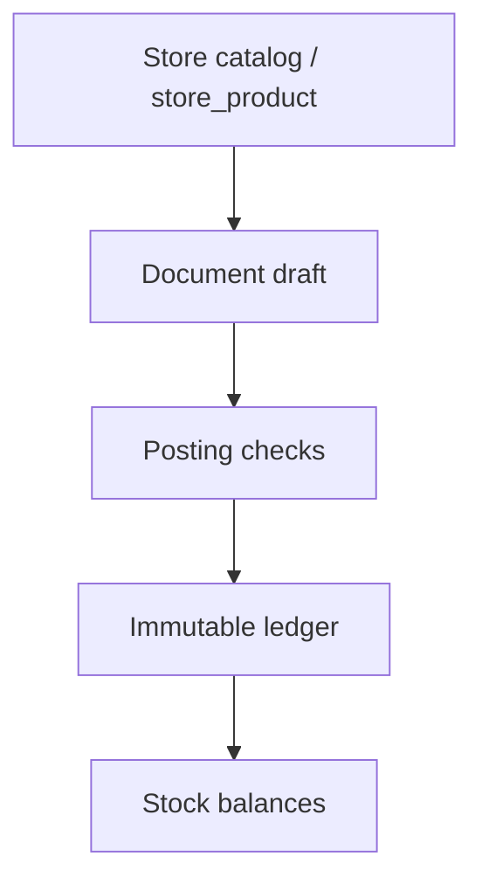

# Logistics (`/store/logistics`)

Демо-модуль **заказов и логистики** внутри раздела **Store**: документы, движение товара и расчёт остатков из неизменяемого журнала. Товары — тот же список, что и каталог Store/PIM (`store_product` в demo Supabase). Данные в self-hosted Supabase проекта Oryx, без логина (`anon` + открытый RLS). Схема соответствует канвасу Orders Logistics Schema.

## Маршруты

| URL | Назначение |
|-----|------------|
| `/store/pim/products` | Единый список товаров (каталог Store). Логистика больше не держит отдельный каталог |
| `/store/pim/products/[id]` | Карточка товара: фото/цена каталога + остатки, заводы и связанные документы |
| `/store/logistics/stock` | Остатки по товарам: итог и разбивка по складам и типам мест |
| `/store/logistics/ledger` | Журнал товарных транзакций |
| `/store/logistics/customer-orders` | Заказы клиента |
| `/store/logistics/reservations` | Резервы (reserve, release, reassign) |
| `/store/logistics/regions` | Справочник регионов (`REG-n` + название; создание из тулбара списка) |
| `/store/logistics/regions/[id]` | Карточка региона: название, резерв по товарам, связанные резервы; название можно править |
| `/store/logistics/shipments` | Отгрузки и возвраты |
| `/store/logistics/returns` | Редирект в единый раздел отгрузок и возвратов |
| `/store/logistics/adjustments` | Корректировки и списания свободного остатка |
| `/store/logistics/adjustments/[id]` | Карточка корректировки: объяснение, знаковые факты, исходный документ |
| `/store/logistics/production-orders` | Заказы на производство |
| `/store/logistics/outputs` | Выпуск |
| `/store/logistics/transfers` | Перемещение |
| `/store/logistics/warehouses` | Склады (создание из шапки списка; в списке видны автокод `WH-n` и название) |
| `/store/logistics/warehouses/[id]` | Карточка склада: автокод, название, остатки, связанные документы; правится только название |
| `/store/logistics/manufacturers` | Заводы (создание сразу со складом; в списке видны автокод `PLT-n` и название) |
| `/store/logistics/manufacturers/[id]` | Карточка завода: автокод, название, склад, остатки, заказы на производство; правится только название |
| `/store/settings` | Настройки Store: префиксы документов (`OMS`, `PO`, `RSV`, …) |

Старые URL `/logistics/...` редиректят сюда. `/logistics/products` и `/store/logistics/products` ведут в `/store/pim/products`.

Пункт **Logistics** больше не в левом рейле — он в aside **Store**. Меню: обзор (товары, прайслисты, заказы клиента, остатки), движение (заказы на производство, перемещения, отгрузки и возвраты), затем выпуски, резервы, корректировки, склады, регионы, заводы, журнал, импорт/экспорт и настройки. `src/features/store/store-nav.ts`, `src/features/logistics/logistics-nav.ts`. Legacy `/store/logistics/releases` redirects to Reservations filtered to release (`?operation=release`). `/store/logistics/returns` и `/store/logistics/returns/[id]` ведут в единый раздел `/store/logistics/shipments`.

## Что видит пользователь

Список — белая toolbar-карточка на `bg-muted/30`, фильтры внутри, таблица ниже. См. [list-page-toolbar.md](../conventions/ui/list-page-toolbar.md). В списках документов колонка товаров — по одной строке с количеством; видно максимум 5, остальные открываются локально по «Ещё N» / «Свернуть». Остатки — три группировки Товары / Склады / Регионы: одна строка на товар с разбивкой владельца (Свободно / Резерв региона / Резерв заказа) и места (Склады / Производство / Перемещения) по одному и тому же количеству в наличии. Shipped и customer-location в матрицу не входят. В тулбаре — чипы группировки, поиск по названию/артикулу и кнопка «Фильтры»; контекстные фильтры открываются в дровере справа, как в каталоге. Фильтры пишутся в URL (`group`, `owner`, `location`, `warehouse`, `region`, `q`). С карточек товара, склада и заказа есть ссылка в отфильтрованные остатки. Конкретные места смотрят в карточке товара. Завод и склад везде, кроме своего списка и своей карточки, показываются только автокодом (`PLT-7`, `WH-1`); полное название — на страницах справочника, где его можно править. Код не редактируется: это префикс + целочисленный id. Склад завода — отдельная сущность (`WH-n`), не копия кода завода.

Большинство документов проходят **Draft → Posted**. Проведённые складские документы (reservation, shipment/return, output, sent transfer, adjustment) неизменяемы: нет удаления фактов и нет сторно. Отгрузка и возврат — один документ без черновика и без `status`: существование означает проведение, код всегда `SHP-n`. На карточке активного документа в тулбаре есть «Отменить»; у закрытого или уже отменённого действия нет. Для запланированного выпуска это подтверждаемая статусная отмена без проводок. Для уже изменившего остатки документа открывается помощник: система считает количества без серий и партий, после других движений нельзя узнать исходные единицы, а удаление старых `+10` при уже уехавших 8 даст `−8`. Открытие окна ничего не меняет. Исправление — новый предметный документ: снять/вернуть/переназначить резерв, создать документ обратного маршрута отгрузки/возврата, отметить доставку и затем обратное перемещение, создать корректировку текущего свободного остатка. Черновик резерва этой кнопкой не отменяется. Заказ клиента через помощник закрывается, не откатывая связанные документы: у OMS снимаются текущие резервы, отгруженное сохраняется. Карточка заказа на производство больше не предлагает «Отменить»: единственный terminal-переход — подтверждённое «Закрыть заказ» (`closeProductionOrder`), которое снимает резервы и списывает оставшийся незавершённый остаток; история движений и завершённые выпуски сохраняются. Существующие записи `cancelled` остаются только для просмотра. Статусы `draft` / `planned` / `in_progress` / `done` свободно редактируются, `done` остаётся операционным до явного закрытия. Если обратное действие недоступно из‑за текущего остатка, помощник объясняет предыдущий шаг и не выполняет небезопасную операцию. Корректировка создаётся и проводится одной транзакцией (`store_create_and_post_adjustment`), без черновика: одна операция на документ («Списание», «Корректировка −» или «Корректировка +»), одно складское место, только свободный остаток, обязательное объяснение в заголовке. Ссылка на исходный документ необязательна; исторический показатель «Произведено» не переписывается. Освободить резерв можно только новым Reservation, который отдаёт количество в Free. Префикс всегда `RSV-n`. Список `/store/logistics/customer-orders` идёт от новых к старым по `created_at`; в `npm run seed:logistics` есть открытый смешанный OMS-906 (20 SKU: 18 с резервом на складах заводов, 2 со свободным готовым наличием без RSV).

Заказ сам остатки не меняет — только потребность и потолок: заказано / занято / отгружено / открыто к резерву. **Резерв — единственный claim**, но владелец больше не обязан быть заказом: `assigned_to_type` + `assigned_to_id` (`order` \| `region` \| оба `null` = Free). Один документ Reservation = одно место + destination owner в заголовке; строки задают товар, количество и source owner. Direction (`reserve` / `release` / `reassign`) выводится: destination задан и все строки из Free → reserve; destination Free → release; иначе reassign. Список всё ещё понимает `?operation=release` как фильтр направления. Место в заголовке: склад, заказ на производство или перемещение в пути.

У заказа есть необязательная дата **ожидаемого окончания** (`expected_end_on`): её ставит менеджер вручную, она не считается из документов и правится в любой момент. Заказ на производство, выпуск и перемещение несут свою такую же дату. В карточке заказа у связанных заказов на производство, выпусков и перемещений дата видна рядом со статусом. Отгрузки и возвраты, резервы и снятия срока не имеют.

Заказ на производство — место и план, не назначение заказа клиента. После создания количество сразу в остатках заказа на производство; статусы (черновик / план / в работе / готов) — только workflow. Заказ на производство виден в заказе клиента, если с его строк резервировали этот заказ (по истории RSV, не только по текущему остатку). Закрытие заказа на производство сначала проводит Reservation в Free на каждый остаточный reserved owner на месте, затем списывает уже свободный остаток; незавершённое производство на склад не переезжает. Выпуск создаётся атомарно через `store_create_production_output` с `p_request_key`: необязательный резерв под заказ клиента, заголовок, линии и опциональное завершение — одна транзакция; повтор ключа возвращает тот же выпуск. Статусы выпуска: **Planned → Done** (плюс Cancelled). Остатки двигаются только при Done. «Под заказ клиента» на выпуске — сахар внутри той же команды. Тихого резерва без документа нет.

Один документ отгрузки/возврата = один заказ + маршрут `fromPlace → toPlace`. Допустимы только `warehouse → customer_order` (**Отгрузка**) и `customer_order → warehouse` (**Возврат**). Направление не хранится. Отгрузка списывает только **order-owned reserved** этого заказа на выбранном складе. Возврат списывает текущий shipped-баланс заказа и товара в `customer_order` на любой склад; destination owner строки — Free, текущий заказ или любой регион. Документ не ссылается на исходную отгрузку. Создание и проводки — одна транзакция `store_create_and_post_shipment`. Reserve then Ship — явная композиция: сначала видимый Reservation из выбранных Free/Region, затем отгрузка; успешный резерв не откатывается, если отгрузка упала. Свободный и региональный остаток напрямую не отгружается. Перемещение не назначает заказ: при отправке allocation несёт `owner_type` + `owner_id`; свободное едет свободным. Создание сразу отправляет документ (`store_create_and_send_transfer`): публичный статус **sent**, без черновика. Пока статус **sent**, место `transfer` ведёт себя как склад: свободное в пути можно зарезервировать обычным RSV. Доставка копирует текущих owner. **sent → delivered**, без частичных приёмок.

Карточка заказа клиента читается как статус и сроки для заказчика и одновременно как ops-хаб. Сверху горизонтальный Journey board: Заказы на производство → Выпуски → Перемещения → Отгрузки. Резервы (reserve/release) и Возвраты живут во вторичном блоке «Связанные», свёрнутом по умолчанию. В колонке этапа может быть несколько документов сразу. Активные процессы заметнее завершённых: код, статус, срок и доля заказа (средний процент покрытия по строкам). Завершённый документ остаётся кликабельной карточкой с номером. Пустой ранний этап выглядит пройденным, если позже уже есть документы; новый ранний процесс снова становится текущим, не пряча параллельные. Действия менеджера только в overflow-меню у этапа; у закрытого заказа клиента меню скрыто. Ожидаемое окончание заказа клиента (`expected_end_on`) правит менеджер вручную. Ниже таблица товаров — матрица Allocation Atlas: Product, Ordered, In production, Produced, In transit, динамические коды складов с текущим резервом этой строки, Shipped. In production — текущий положительный reserved WIP этой строки на местах `production_order`; Produced — накопительный завершённый выпуск по строке, не текущий остаток. In production, In transit и склады нельзя складывать с Produced: разные базы, значения могут пересекаться. In transit и склады показывают только текущий reserved этой строки; Shipped крайняя справа; мягкая подсветка только у полностью отгруженных строк; Reserve, Ship и Release — в overflow-меню ячейки Product. Универсальная таблица движений на карточке: Время / Изменение / Товар / Место / Владелец / Документ; колонка родителя скрыта; на заказе и регионе видны обе ноги документа, который трогал эту сущность. Первая страница — 20 новейших фактов, виден total, дальше пагинация.

## Поток данных



Проведение и проверка доступности выполняются одной RPC-транзакцией Postgres (`store_post_*`, `store_create_and_post_shipment`, `store_create_and_send_transfer`, `store_send_transfer`, `store_complete_transfer`, `store_create_production_output`, …). Повторный вызов не создаёт новых движений: идемпотентность = текущий статус документа или ключ запроса. Сторно-RPC нет. Корректировка создаётся атомарно через `store_create_and_post_adjustment`; повтор этого вызова пишет новый документ. Отгрузка и возврат создаются атомарно через `store_create_and_post_shipment` с `p_request_key`. Выпуск создаётся атомарно через `store_create_production_output` с `p_request_key`.

## Модель

Минимальные сущности канваса: **общий товар** (`store_product`, тот же integer id что в каталоге Store, необязательный `manufacturer_id`), производитель (ровно один склад), склад, регион (`store_region`, код `REG-n`), заказ, заказ на производство, единый резерв Reservation (destination + source owners), перемещение, единый документ отгрузки и возврата (`store_shipment`), выпуск, корректировка свободного остатка, факт журнала, справочник demo-пользователей, история документа.

Владелец остатка — полиморфная пара `assigned_to_type` + `assigned_to_id` (в allocations по-прежнему `owner_type` + `owner_id`). Free = оба NULL. Заказ и регион могут держать reserved stock. Позиция остатка = товар + место + назначение, без `stock_state`. `stock_state` считается только для старых читателей: нет assigned_to → free; assigned_to задан и место не `customer_order` → reserved; место `customer_order` → shipped. `customer_order_id` / `customer_order_line_id` как claim-поля больше нет. Заголовок документа отгрузки/возврата ссылается на один заказ и физический маршрут. Строка — `product_id` + qty + destination owner; уникальность строки: документ + товар + destination owner. Отгрузка забирает reserved stock этого заказа по товару. Возврат ограничен текущим shipped-балансом заказа и товара, без ссылки на исходную отгрузку. В одном заказе клиента товар уникален: спрос, резерв и отгрузка считаются по `order + product`.

Журнал хранит только факты: `id`, `created_at`, `product_id`, знаковое `quantity ≠ 0`, `location_type` (`warehouse` \| `production_order` \| `transfer` \| `customer_order`) + `location_id`, `assigned_to_*`, `document_type` (`reservation` \| `shipment` \| `return` \| `transfer` \| `production_order` \| `output` \| `adjustment`) + `document_id`. Направления нет кроме знака quantity. Место резерва на производстве — сам `production_order`, не строка. Документ держит текущие `status` (кроме отгрузки/возврата: статуса нет), `expected_end_on`, `created_at`, `created_by`. Создание и каждая смена статуса или плановой даты атомарно пишут снимок в `store_document_history` (`created` \| `status_changed` \| `expected_end_changed`). Lifecycle-timestamps (`posted_at`, `sent_at`, `done_at`, `closed_at`, `cancelled_at`) на документе нет. Автор — зашитый demo-пользователь `store_user.id = 1`, без логина.

Все таблицы Store имеют sequential `bigint identity` PK (журнал — `id`). Отображаемый код **не хранится**: `formatLogisticsCode` / `public.store_code(kind, id)` → `PREFIX-id`. Дефолты в `LOGISTICS_CODE_PREFIXES`; живые значения — `store_setting.code_prefixes`, правятся на `/store/settings`:

| Kind | Prefix | Example |
|------|--------|---------|
| product | PRD | PRD-1 |
| manufacturer | PLT | PLT-7 |
| warehouse | WH | WH-1 |
| region | REG | REG-1 |
| customer order | OMS | OMS-12 |
| production order | PO | PO-1 |
| reservation (reserve, release, or reassign) | RSV | RSV-1 |
| transfer | TR | TR-1 |
| shipment / return | SHP | SHP-1 |
| output | OUT | OUT-1 |
| adjustment | ADJ | ADJ-1 |
| lines / allocations / ledger / setting | COL POL RSVL TRL TRA SHL OUTL OUA RETL ADJL TXN SET | COL-1 |

URL используют integer id (`/store/logistics/customer-orders/12`, `/store/pim/products/1`). Старые строковые id (`p-6365`, `po-e004c202-…`, `OMS-120`, `SH-4`) сняты.

Состояния остатка выводятся из назначения и места. Места: склад, заказ на производство, перемещение, заказ клиента. Отгрузка может списать только reserved stock с `assigned_to_type=order`. Журнальный класс документа остаётся `shipment` или `return` по маршруту. `/store/logistics/ledger` показывает те же шесть колонок без State / Source / Reversal и фильтрует по классу документа.

Каталог читает те же строки: цены и фото пишутся в `dealer_price` / `retail_price` / `image_url` при `npm run seed:logistics` из снимка Корпортала (`media` collection `photos`). В `image_url` кладётся Spatie **medium** (`/s3/media/{YYYY}/{MM}/{DD}/{HH}/{id}/conversions/{stem}-medium.webp`); если medium нет — `small`, затем `big`; оригинал (`/{id}/{file}`) только когда конверсий нет. Если фото нет — muted placeholder, не Unsplash. Если цены в снимке нет, UI считает демо-цену на клиенте.

## Бэкенд

- Клиент: `src/lib/supabase/client.ts`
- Пути: `src/features/logistics/logistics-paths.ts`
- Каталог из той же таблицы: `src/features/store/store-catalog-from-logistics.ts`
- Миграции: `supabase/migrations/20260916200000_logistics.sql` и последующие `logistics_*`, integer PK `20260917230000`–`20260917230200`, единая Reservation `20260918100000_logistics_unified_reservation.sql`, префикс схемы `20260918120000_store_schema_prefix.sql`, generic owner `20260919010000_store_owner_reservations.sql`, create-and-send перемещений `20260920122000_store_transfer_direct_send.sql`, журнал фактов + `store_user` / `store_document_history` `20260921120000_store_stock_transaction_facts.sql`, корректировки `20260921140000_store_stock_adjustments.sql`, единые отгрузки и возвраты `20260921160000_store_unified_shipment.sql`, атомарный выпуск `20260921210000_store_create_production_output.sql`
- Коды: `src/features/logistics/logistics-codes.ts`, `store_setting.code_prefixes` (UI: `/store/settings`) и `public.store_code`
- Seed: `npm run seed:logistics` — remapped Korportal snapshot in `scripts/data/logistics-demo.json` (dense integer ids 1…n, no stored document codes). Equipment products, plants + plant warehouses, optional `store_product.manufacturer_id` from `pim_product_variants.plant_id`, non-deleted OMS orders. Seed copies portal `image_url` / prices from that snapshot and infers category/family. Story seed also posts a Free → region Reservation (RSV-930, Enduro at the Shineray plant warehouse → `REG-1`) so the UI can demo reassign.
- Product–plant: Korportal stores the factory on the variant (`pim_product_variants.plant_id` → `pim_plants`). Import copies that onto `store_product.manufacturer_id` (nullable; no junction). Creating production from a product (or with selected products) offers only that plant; a product without a plant can use any plant.
- Завод и склад вне своего списка и своей карточки показываются только автокодом (`ManufacturerLink` / `WarehouseLink`).

Как работать с инстансом: [supabase.md](../conventions/backend/supabase.md).

## Локальная проверка

```bash
npm run seed:logistics
npm run dev
# http://localhost:3000/store/logistics/stock
# http://localhost:3000/store/pim/products
# http://localhost:3000/store/settings
# http://localhost:3000/logistics/stock  → redirect
```
