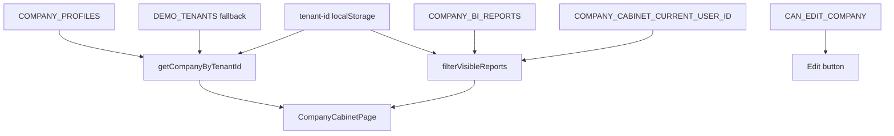

# Pulse — Company workspace (`/pulse/company`)

Раздел **Company workspace** в модуле Pulse: витрина данных текущей компании (tenant) — профиль, реквизиты, файлы и BI-отчёты. Сейчас работает на **demo-данных** в браузере (без API).

## Маршруты и навигация

| URL | Назначение |
|-----|------------|
| `/pulse/company` | Страница кабинета компании |

- Пункт **Company workspace** в subnav Pulse: `src/features/pulse/pulse-nav.ts`
- Пункт **Company workspace** в user menu (nav rail): `src/components/layout/nav-rail.tsx`
- Global search: «Company workspace» → `/pulse/company`
- Layout модуля: `app/pulse/layout.tsx` (`ModuleShell` + aside)

## Что видит пользователь

Компактная витрина: breadcrumb → hero → **BI reports** (первый экран) → legal details + files.

### Hero

- Логотип, название компании, краткое описание (до 2 строк)
- Read-only поля (пустые → `—`): **Country**, **Contact person**, **Contract start date**, **Contract end date**
- Контакты — блок справа в hero (website, email, phone, address); адрес ведёт к якорю `#company-details`
- **Edit** — outline-кнопка справа, если `CAN_EDIT_COMPANY === true`; ведёт на `/settings/companies`

### Порядок секций (сверху вниз)

| # | Секция | Содержимое | Пустое состояние |
|---|--------|------------|------------------|
| 1 | **BI reports** | Компактные строки-ссылки, сетка до 4 колонок | «No reports available» |
| 2 | **Details** | Список пар «название + значение» (`legalParameters`) | «No requisites added» |
| 3 | **Company files** | Компактный список (имя, размер, дата) | «No company files yet» |

Реквизиты и файлы — на втором экране; отчёты всегда видны сразу под hero.

### BI-отчёты

Отчёт показывается, если одновременно:

1. `showInCompanyCabinet === true`
2. `tenantIds` содержит текущий tenant
3. `allowedUserIds` пустой (доступ всем) **или** содержит `COMPANY_CABINET_CURRENT_USER_ID` (`emp-12`)

Demo-сценарии:

- **Globaldrive** — файлы + 3 отчёта (Order funnel скрыт: нет доступа у emp-12)
- **Lunnar Capital** — нет файлов, 1 отчёт (Operational KPIs)
- **OryxBMS** — 1 файл, 1 отчёт (Inventory health)
- **Sharmax Belarus** — файлы + 2 отчёта
- Остальные tenant — fallback-профиль, пустые requisites/files/reports, поля hero с `—`

### Tenant switcher

Страница читает `tenant-id` из `localStorage` (тот же ключ, что user menu). При смене tenant в меню страница обновляется через событие `oryx:tenant-id-change`.

## Поток данных

## Файлы

| Файл | Роль |
|------|------|
| `app/pulse/company/page.tsx` | Route + metadata |
| `src/features/pulse/company/company-cabinet-page.tsx` | Оркестрация страницы |
| `src/features/pulse/company/company-cabinet-hero.tsx` | Компактный hero + контакты + Edit |
| `src/features/pulse/company/company-cabinet-demo-data.ts` | Типы и demo-данные |
| `src/features/pulse/company/company-cabinet-utils.ts` | getCompanyByTenantId, filterVisibleReports |
| `src/features/pulse/company/company-requisites-section.tsx` | Реквизиты (итеративный вывод двух списков) |
| `src/features/pulse/company/company-files-section.tsx` | Файлы |
| `src/features/pulse/company/company-reports-section.tsx` | BI-отчёты |
| `src/lib/use-demo-tenant-id.ts` | Hook синхронизации с tenant switcher |

## TODO (после demo)

- Подключить auth/RBAC вместо `CAN_EDIT_COMPANY`
- API для профиля, файлов и отчётов
- Inline-редактирование или полноценная форма в Settings
