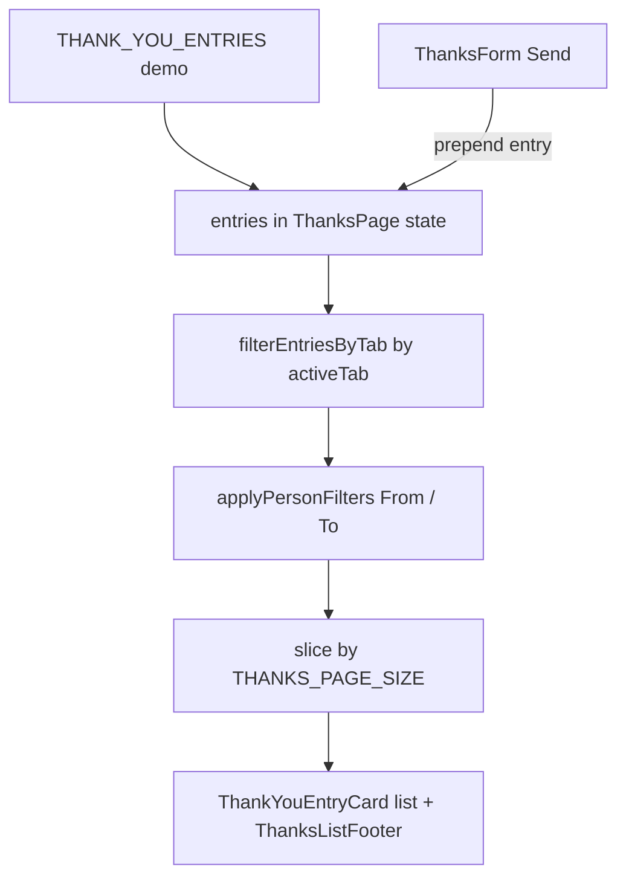

# Pulse — Thanks (`/pulse/thanks`)

Раздел **Thanks** в модуле Pulse: просмотр благодарностей коллегам, отправка новых сообщений, фильтрация и пагинация. Сейчас работает на **demo-данных** в браузере (без API).

## Маршруты и навигация

| URL | Назначение |
|-----|------------|
| `/pulse/thanks` | Страница раздела |

- Пункт **Thanks** в боковом subnav Pulse: `src/features/pulse/pulse-nav.ts`
- Layout модуля: `app/pulse/layout.tsx` (`ModuleShell` + aside)

На главной (`/`) есть блок «Say thanks» с упрощённой формой (`HomeThanksSection` → `ThanksForm` без списка).

## Что видит пользователь

### Шапка (toolbar)

Компактная **белая карточка** на сером фоне страницы — тот же паттерн, что у каталога товаров. См. [list-page-toolbar.md](../conventions/ui/list-page-toolbar.md).

- Заголовок **Thanks**, краткое описание
- Кнопка **Say thank you** — открывает боковую панель (Sheet) с формой
- Разделитель
- **Вкладки** с счётчиками: Received, Sent, All
- **Фильтры** From / To (селекты «Anyone» или конкретный сотрудник), кнопка **Clear**

### Вкладки

| Вкладка | Содержимое |
|---------|------------|
| **Received** | Записи, где получатель — текущий пользователь (`recipientId === emp-12`) |
| **Sent** | Записи, где отправитель — текущий пользователь |
| **All** | Все благодарности в demo-ленте (для прототипа видна всем; позже — только админам, см. TODO в коде) |

При смене вкладки сбрасываются фильтры From/To и номер страницы пагинации.

### Список

- **Received / Sent**: сетка карточек `1 → 2 → 3` колонки (`md` / `xl`)
- **All**: одна колонка на всю ширину; в карточке горизонтально **From → To**, текст сообщения под чертой
- **Пагинация**: 12 записей на страницу (`THANKS_PAGE_SIZE`), футер «Showing X of Y» + стандартные Previous / номера / Next (`ThanksListFooter`, `buildPaginationItems` из `src/lib/pagination.ts`)

### Отправка благодарности

1. **Say thank you** → Sheet справа
2. Выбор коллеги (себя в списке нет), текст до 280 символов
3. **Send** → toast «Thank-you sent», запись добавляется **в начало** локального state, вкладка переключается на **Sent**, Sheet закрывается

Данные до перезагрузки страницы сохраняются только в React state (demo).

### Пустые состояния

- Нет записей на вкладке — текст + **Say thank you**
- Есть записи на вкладке, но фильтры ничего не нашли — **No matches** + **Clear filters**

## Поток данных (как работает логика)



1. Инициализация: `useState(THANK_YOU_ENTRIES)` из `thanks-demo-data.ts`
2. **По вкладке**: `filterEntriesByTab` (received / sent / all)
3. **По фильтрам**: `applyPersonFilters` (`senderId`, `recipientId`; `all` = без ограничения)
4. **Пагинация**: `filteredEntries.slice((page - 1) * 12, page * 12)`
5. **Отправка**: `handleSent` добавляет объект `ThankYouEntry` в `entries`

Счётчики на вкладках (`Received (31)`) считаются от полного `entries`, без учёта фильтров From/To.

## Модель данных

```ts
type ThankYouEntry = {
  id: string;
  senderId: string;
  senderName: string;
  senderDepartment: string;
  recipientId: string;
  recipientName: string;
  recipientDepartment: string;
  message: string;
  sentAtLabel: string; // отображаемая дата, demo
};
```

**Текущий пользователь (demo):**

- `THANKS_CURRENT_USER_ID` = `emp-12` (Alexey Nazarov, Security)

**Сотрудники для формы и фильтров:** `EMPLOYEE_OPTIONS` в `src/components/home/thanks-demo-data.ts`

**Аватары:** `THANKS_EMPLOYEE_AVATARS` + `getThanksEmployeeAvatarUrl()` в `thanks-demo-data.ts` (loremflickr, как в Team)

**Генерация demo:** ~11 seed-записей + программная генерация (30+ sent, 30+ received, cross-feed для All) в `buildGeneratedEntries()`.

## Структура файлов

```text
app/pulse/thanks/page.tsx          # metadata + рендер ThanksPage

src/features/pulse/thanks/
  thanks-page.tsx                  # страница: state, фильтры, вкладки, список, Sheet
  thanks-toolbar.tsx               # белая шапка: title, tabs, embedded filters
  thanks-person-filters.tsx          # From / To selects (standalone | embedded)
  thanks-entry-card.tsx            # карточка записи (variant: received | sent | all)
  thanks-form.tsx                  # форма отправки (Sheet и home block)
  thanks-list-footer.tsx           # пагинация
  thanks-demo-data.ts              # тип, demo entries, avatars, PAGE_SIZE

src/components/home/
  thanks-demo-data.ts              # EMPLOYEE_OPTIONS для select
  thanks-mine-demo-data.ts         # re-export sent для legacy
  home-thanks-section.tsx          # блок на главной
```

## UI-правила проекта

- Английский UI: [english-labels.md](../conventions/ui/english-labels.md), `npm run check:ui-english`
- Ширина и сетка: [full-width-page-content.md](../conventions/ui/full-width-page-content.md)
- Шапка над списком: [list-page-toolbar.md](../conventions/ui/list-page-toolbar.md)

## Подключение к бэкенду (план)

Сейчас API нет. Типичная замена demo:

1. Загрузка списка: `GET /thanks?tab=…&sender=…&recipient=…&page=…` → заменить `THANK_YOU_ENTRIES` и server-side slice
2. Отправка: `POST /thanks` → в `ThanksForm` вместо локального `onSent`
3. Текущий пользователь: из сессии вместо `THANKS_CURRENT_USER_ID`
4. Вкладка **All**: скрывать при `!isAdmin` (комментарий TODO в `thanks-page.tsx`)
5. Аватары: URL из профиля сотрудника

`ThankYouEntry` и цепочка tab → person filters → pagination можно сохранить; меняется только источник `entries` и мутации после Send.

## Локальная проверка

```bash
npm run dev
# http://localhost:3000/pulse/thanks

npm run check:ui-english
```

## Связанные материалы

- [AGENTS.md](../../AGENTS.md) — вход для агентов
- [docs/conventions/README.md](../conventions/README.md) — UI/layout conventions
