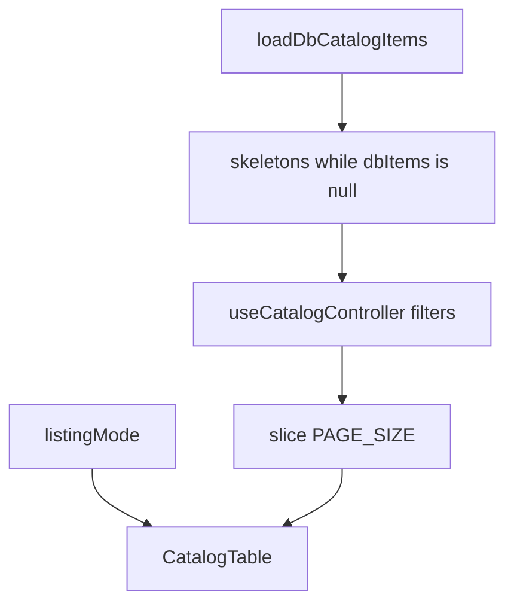

# Store PIM — каталог товаров

Единая страница **Products** (`/store/pim/products`): просмотр вариантов в таблице, фильтрация, настройка колонок, пагинация. Источник — `store_product_variant` (+ `store_product` / `store_plant` / `store_product_price`) в demo Supabase. Пока запрос не завершён, таблица показывает скелетоны. Если Supabase не настроен, запрос вернул `null` или упал с ошибкой, список пустой — локальный demo-массив на этой странице не используется.

Логистика живёт в том же разделе Store (`/store/logistics/...`). Отдельного каталога товаров у логистики нет.

Переключатель **Base products** / **Product variants** в toolbar (чипы, как вкладки в Pulse Thanks). Отдельного пункта subnav и маршрута каталога вариантов больше нет.

## Маршруты и навигация

| URL | Поведение |
|-----|-----------|
| `/store/pim/products` | Каталог; режим по умолчанию — base products |
| `/store/pim/products?listing=variants` | Тот же каталог в режиме product variants |
| `/store/pim/products/[productId]` | Карточка: demo PIM UI для старых `bike-*` id, иначе логистическая карточка того же варианта. Код — `PRD-{id}` (`formatLogisticsCode`), фото из `store_product_variant.image_url` (Корпортал Spatie medium `/s3/media/.../conversions/{stem}-medium.webp`). |
| `/store/logistics/...` | Заказы клиента, остатки, заказы на производство — см. [logistics.md](logistics.md) |

- Страница: `app/store/pim/products/page.tsx` → `StoreCatalogPage`
- Subnav Store: **Products** / **Pricelists** / **Orders** / **Stock**, затем движение, затем справочники, **Ledger**, импорт/экспорт и настройки (`src/features/store/store-nav.ts`)
- Карточка товара: `/store/pim/products/[productId]` — тот же `id`, что в `store_product_variant` / строках заказов

## Переключатель listing mode

В `catalog-toolbar.tsx` — `role="tablist"`, чипы `HomeFilterChip`:

| Режим | `listingMode` | Подпись UI |
|-------|---------------|------------|
| Базовые товары | `products` | Base products |
| Варианты | `variants` | Product variants |

**Источник правды для режима — URL** (`?listing=variants` или без query). `localStorage` (`store-catalog-listing-mode`) используется только при первом заходе без query: если сохранён `variants`, выполняется `router.replace` с query.

При смене режима:

1. Меняется `aria-label` у **Add** (подзаголовок страницы общий)
2. Подключается свой ключ `localStorage` для колонок (см. ниже)
3. Сбрасывается страница пагинации на 1, закрывается панель Columns
4. `router.replace` обновляет URL и пишет режим в `store-catalog-listing-mode`

Фильтры и поиск **общие** при переключении (не сбрасываются). Источник данных тот же (`loadDbCatalogItems`); при смене режима таблица снова показывает скелетон ~200 ms (как при смене фильтра).

### Источники данных

| Режим | Источник | Содержимое |
|-------|----------|------------|
| Base products / variants | `loadDbCatalogItems()` → `store_product_variant` + relational `store_product_price` | Те же варианты, что в логистике; завод как код `PLT-n`; цены из `store_product_price` |
| Нет Supabase / ошибка / `null` | пустой массив | Скелетоны до ответа, затем пустое состояние |

Ссылки с варианта ведут на карточку **родительского** товара (`getCatalogItemDetailHref`).

## Что видит пользователь

### Шапка (toolbar)

Паттерн [list-page-toolbar.md](../conventions/ui/list-page-toolbar.md). Заголовок всегда **Products**.

- Чипы listing mode → строка фильтров (поиск, категория, статусы, Filters, Columns)
- Список всегда в виде таблицы. При наведении на миниатюру товара слева всплывает увеличенное изображение (tooltip через `@base-ui/react/tooltip`, `side="left"`).

### Различия products vs variants

| Аспект | Base products | Product variants |
|--------|---------------|------------------|
| Префикс цены | `from 11,990 USD` | `11,990 USD` |
| Таблица: dealer | Цена + статус | + icon buy |

### Пагинация и состояния

- 48 записей на страницу (`PAGE_SIZE`)
- Имитация загрузки ~200 ms при смене фильтров/страницы (`use-catalog-controller`)
- Пустой список: «No products match the selected filters.»

## Поток данных


```mermaid
flowchart TD
  db[loadDbCatalogItems]
  wait[skeletons while dbItems is null]
  filter[useCatalogController filters]
  page[slice PAGE_SIZE]
  ui[CatalogTable]
  mode[listingMode]

  db --> wait
  wait --> filter
  mode --> ui
  filter --> page
  page --> ui
```

## localStorage (по режимам)

| Назначение | products | variants |
|------------|----------|----------|
| Колонки | `store-catalog-visible-columns` | `store-variants-catalog-visible-columns` |
| Listing mode (страница) | `store-catalog-listing-mode` | то же |

При смене `listingMode` контроллер получает новый `columnsStorageKey`; колонки подгружаются заново (`columnsHydratedKey` предотвращает запись «чужих» колонок в новый ключ).

## Модель данных

Тип `StoreCatalogItem` общий. Список каталога читает БД; массив `STORE_CATALOG_ITEMS` остаётся только для demo-карточки `bike-*` и прайс-листов.

**Покупка:** `getPurchaseBlockReason` + `CatalogBuyTooltip` (режим variants).

## Структура файлов

```text
app/store/pim/products/page.tsx

src/components/store/pim/products/
  store-catalog-page.tsx                  # listingMode state, URL, toolbar props
  store-catalog-demo-data.ts

  catalog/
    catalog-helpers.ts                    # listing labels, storage keys, parseListingMode
    catalog-toolbar.tsx                   # listing chips + filters
    use-catalog-controller.ts
    catalog-table.tsx
    ...
```

## Технические нюансы

- **`StoreCatalogPage`** больше не принимает `config` prop — один маршрут, режим из `useSearchParams`.
- **Миниатюра товара** в колонке Name — `Link` на товар + tooltip с увеличенным изображением слева.
- **Add** в toolbar без handler (заглушка).
- **Русский UI** для подписей чипов (`CATALOG_LISTING_MODE_LABELS`). См. [russian-labels.md](../conventions/ui/russian-labels.md).

## Подключение к бэкенду

Каталог читает `store_product_variant` (+ relational `store_product_price`) через anon-клиент (`src/features/store/store-catalog-from-logistics.ts`). Завод варианта — nullable `store_product_variant.plant_id` (в UI — код `PLT-n`). Карточка с id из БД — логистическая страница (`ProductDetailPage` в `catalog-pages.tsx`).

## Локальная проверка

```bash
npm run dev
# http://localhost:3000/store/pim/products
# http://localhost:3000/store/pim/products?listing=variants
# http://localhost:3000/store/logistics/stock

npm run lint
npm run typecheck
npm run build
npm run check:static-images
```

После запуска вручную проверьте оба режима каталога, фильтры, пагинацию и переход в карточку товара.

## Связанные материалы

- [AGENTS.md](../../AGENTS.md)
- [pulse-thanks.md](pulse-thanks.md) — паттерн чипов в toolbar
