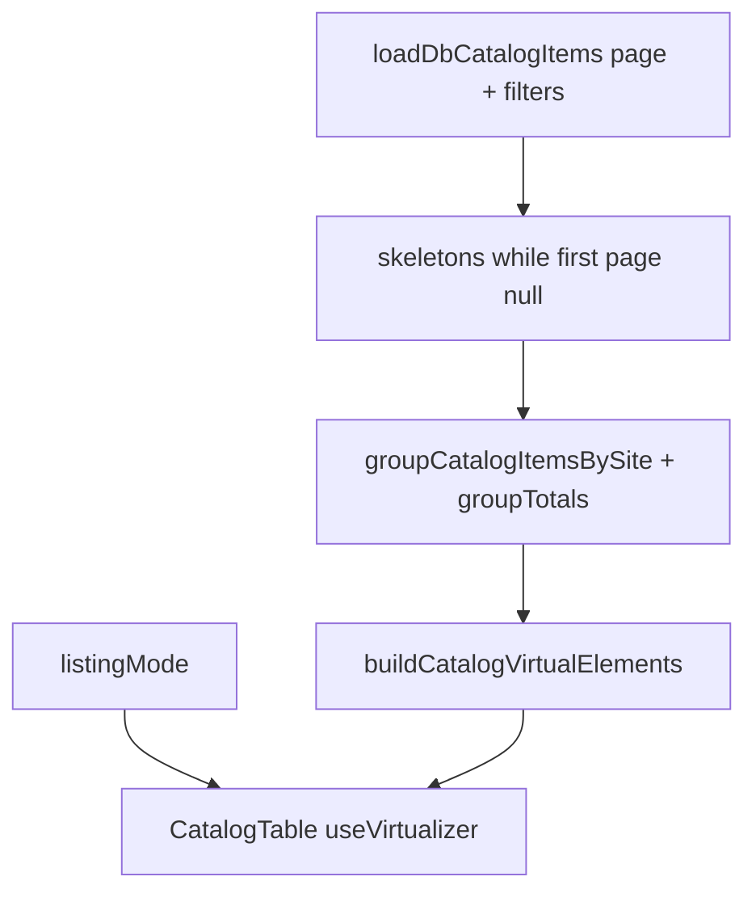

# Store PIM — каталог товаров

Единая страница **Products** (`/store/pim/products`): просмотр вариантов в таблице, фильтрация на стороне запроса, настройка колонок, группировка по площадке в одном виртуальном скролле. Источник — `store_product_variant` (+ `store_product` / `store_plant` / `store_product_price` / категории и семейства) в demo Supabase. Пока первая порция не пришла, таблица показывает скелетоны. Если Supabase не настроен, запрос вернул `null` или упал с ошибкой, список пустой — локальный demo-массив на этой странице не используется.

Логистика живёт в том же разделе Store (`/store/logistics/...`). Отдельного каталога товаров у логистики нет.

Переключатель **Base products** / **Product variants** в toolbar (чипы, как вкладки в Pulse Thanks). Отдельного пункта subnav и маршрута каталога вариантов больше нет.

## Маршруты и навигация

| URL | Поведение |
|-----|-----------|
| `/store/pim/products` | Каталог; режим по умолчанию — base products |
| `/store/pim/products?listing=variants` | Тот же каталог в режиме product variants |
| `/store/pim/products/[productId]?variant=` | Карточка товара по `store_product.id`: demo PIM UI для старых `bike-*`, иначе новая карточка с списком вариантов и `?variant=`. |
| `/store/pim/variants/[variantId]` | Редирект на карточку товара с `?variant=`. Ссылки из логистики (`hrefForStoreProduct`) ведут сюда. |
| `/store/logistics/...` | Заказы клиента, остатки, заказы на производство — см. [logistics.md](logistics.md) |

- Страница: `app/store/pim/products/page.tsx` → `StoreCatalogPage`
- Subnav Store: **Products** / **Pricelists** / **Orders** / **Stock**, затем движение, затем справочники, **Ledger**, импорт/экспорт и настройки (`src/features/store/store-nav.ts`)
- Каталог ссылается на `/store/pim/products/{productId}?variant={variantId}`

## Контекст региона

Один выбранный регион в `localStorage` (`store-selected-region`) общий для каталога, карточки товара и прайс-листов. Переключатель — поиск-комбобокс (`RegionSwitcher`): код, валюты, код хаба. Без выбранного региона цены и «Готово · Всего» показывают заглушку «Выберите регион».

**Готово** = свободно + резерв под регион на хабе региона (`store_region.hub_warehouse_id`). **Всего** = остатки на хабах/заводах + в производстве (draft-выпуски) + в пути. Детализация — поповер с кодами мест (`WH-n`). Расчёт: `computeVariantRegionStock` / RPC `store_variant_stock_facts`.

## Переключатель listing mode

В `catalog-toolbar.tsx` — `role="tablist"`, чипы `HomeFilterChip`:

| Режим | `listingMode` | Подпись UI |
|-------|---------------|------------|
| Базовые товары | `products` | Base products |
| Варианты | `variants` | Product variants |

**Источник правды для режима — URL** (`?listing=variants` или без query). `localStorage` (`store-catalog-listing-mode`) используется только при первом заходе без query: если сохранён `variants`, выполняется `router.replace` с query.

При смене режима:

1. Меняется `aria-label` у **Add** (подзаголовок страницы общий)
2. Подключается свой ключ `localStorage` для колонок (см. ниже)
3. Закрывается панель Columns
4. `router.replace` обновляет URL и пишет режим в `store-catalog-listing-mode`

Фильтры и поиск **общие** при переключении (не сбрасываются). Источник данных тот же (`loadDbCatalogItems`); смена режима не перезапрашивает порции. Группы площадок те же в обоих режимах; отличаются только префикс цены и кнопка покупки.

### Источники данных

| Режим | Источник | Содержимое |
|-------|----------|------------|
| Base products / variants | `loadDbCatalogItems({ offset, limit, filters })` → `store_product_variant` + relational product/category/family + `store_product_price` | Порция вариантов; завод как код `PLT-n`; цены из `store_product_price`; категория/семейство из справочников магазина |
| Нет Supabase / ошибка / `null` | пустой массив | Скелетоны до ответа первой порции, затем пустое состояние |

Ссылки с варианта ведут на карточку **родительского** товара (`getCatalogItemDetailHref`).

## Что видит пользователь

### Шапка (toolbar)

Паттерн [list-page-toolbar.md](../conventions/ui/list-page-toolbar.md). Заголовок всегда **Products**.

- Чипы listing mode → строка фильтров (поиск, категория, статусы, Filters, Columns) → **Свернуть все** / **Развернуть все** (группы площадок)
- Список всегда в виде таблицы. При наведении на миниатюру товара слева всплывает увеличенное изображение (tooltip через `@base-ui/react/tooltip`, `side="left"`).

### Группировка по площадке

После фильтров строки всегда сгруппированы по `productionSite` (код площадки). В заголовке группы — только код, шеврон и `pluralTovar(n)` по **полному** числу строк группы в текущем фильтре (не только уже скачанные). Клик по заголовку сворачивает/разворачивает одну группу. «—» (нет площадки) показывается как «Без площадки» и идёт после кодов. Коды сортируются численно (`PLT-2` перед `PLT-10`); внутри группы — порядок `id` из загрузчика. Названия площадок не показываются ([place-codes.md](../conventions/ui/place-codes.md)).

### Различия products vs variants

| Аспект | Base products | Product variants |
|--------|---------------|------------------|
| Префикс цены | `from 11,990 USD` | `11,990 USD` |
| Таблица: dealer | Цена + статус | + icon buy |

### Скролл и состояния

- Пагинации в UI нет: один скролл фиксированной высоты (`max-h-[calc(100vh-220px)]`)
- Данные приходят **порциями** с demo Supabase (`PAGE_SIZE`); следующая порция — у конца уже загруженного списка. Смена поиска, фильтра или региона сбрасывает список на первую порцию
- Поиск (название и код) и фильтры (категория, семейство, площадка, статусы дилера и розницы) уходят в запрос. Статусы — выбранного региона; без региона фильтр статуса ничего не отсекает, цены — «Выберите регион»
- Категория — `store_category` / `store_product_category` (зашитое дерево UI мапится на коды БД); семейство — `store_product.family_id`. Угадывание по названию для фильтра и колонок не источник
- В DOM только окно строк (`@tanstack/react-virtual`); свёрнутая группа — только заголовок. Под шапкой прилипает код площадки. Счётчик группы — полное число в текущем фильтре
- Порядок: площадка (`plant_id`), без площадки в конце, затем `id`
- Первая порция — скелетоны; догрузка их не ставит вместо списка. Пустой ответ — «Нет товаров, подходящих под выбранные фильтры.»
- Цена «от …» и покупка как в режиме products / variants

## Поток данных


```mermaid
flowchart TD
  db[loadDbCatalogItems page + filters]
  wait[skeletons while first page null]
  groups[groupCatalogItemsBySite + groupTotals]
  virtual[buildCatalogVirtualElements]
  ui[CatalogTable useVirtualizer]
  mode[listingMode]

  db --> wait
  wait --> groups
  groups --> virtual
  mode --> ui
  virtual --> ui
```

## localStorage (по режимам)

| Назначение | products | variants |
|------------|----------|----------|
| Колонки | `store-catalog-visible-columns` | `store-variants-catalog-visible-columns` |
| Listing mode (страница) | `store-catalog-listing-mode` | то же |

Свёртка групп площадок **не** пишется в URL и localStorage.

При смене `listingMode` контроллер получает новый `columnsStorageKey`; колонки подгружаются заново (`columnsHydratedKey` предотвращает запись «чужих» колонок в новый ключ).

## Модель данных

Тип `StoreCatalogItem` общий. Список каталога читает БД; массив `STORE_CATALOG_ITEMS` остаётся только для demo-карточки `bike-*` и прайс-листов.

**Покупка:** `getPurchaseBlockReason` + `CatalogBuyTooltip` (режим variants).

## Структура файлов

```text
app/store/pim/products/page.tsx

src/components/store/pim/products/
  store-catalog-page.tsx                  # listingMode state, URL, toolbar props
  store-catalog-demo-data.ts

    catalog/
      catalog-helpers.ts                    # listing labels, storage keys, re-exports site groups
      catalog-site-groups.ts                # groupCatalogItemsBySite, virtual elements, totals
      catalog-toolbar.tsx                   # listing chips + filters + collapse/expand
      use-catalog-controller.ts
      catalog-table.tsx                     # useVirtualizer + sticky site strip
      ...
```

## Технические нюансы

- **`StoreCatalogPage`** больше не принимает `config` prop — один маршрут, режим из `useSearchParams`.
- **Миниатюра товара** в колонке Name — `Link` на товар + tooltip с увеличенным изображением слева.
- **Add** в toolbar без handler (заглушка).
- **Русский UI** для подписей чипов (`CATALOG_LISTING_MODE_LABELS`). См. [russian-labels.md](../conventions/ui/russian-labels.md).

## Подключение к бэкенду

Каталог читает порции `store_product_variant` (+ product / category / family + relational `store_product_price`) через anon-клиент (`src/features/store/store-catalog-from-logistics.ts`). Завод варианта — nullable `store_product_variant.plant_id` (в UI — код `PLT-n`). Карточка с id из БД — логистическая страница (`ProductDetailPage` в `catalog-pages.tsx`).

## Локальная проверка

```bash
npm run dev
# http://localhost:3000/store/pim/products
# http://localhost:3000/store/pim/products?listing=variants
# http://localhost:3000/store/logistics/stock

npm run lint
npm run typecheck
npm run build
npm run check:static-images
```

После запуска вручную проверьте оба режима каталога, группировку по площадке, свёртку групп, фильтры и переход в карточку товара.

## Связанные материалы

- [AGENTS.md](../../AGENTS.md)
- [pulse-thanks.md](pulse-thanks.md) — паттерн чипов в toolbar
