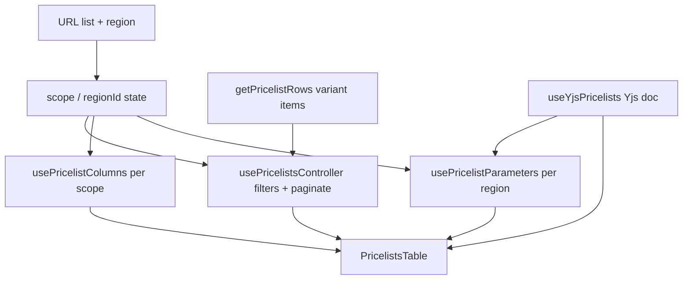

# Store PIM — прайслисты

Страница **Pricelists** (`/store/pim/pricelists`): редактирование закупочных, дилерских и розничных цен в одной таблице **совместно и в реальном времени** (Yjs + WebSocket). Три типа прайслиста (**Global / Supplier / Dealer**), выбор региона, динамические колонки-параметры с формулами, presence-индикаторы соавторов. Данные — **demo** (варианты из каталога + детерминированные seed-значения), но изменения синхронизируются между вкладками/клиентами через collab-сервер.

## Маршруты и навигация

| URL | Поведение |
|-----|-----------|
| `/store/pim/pricelists` | Основная страница прайслистов → `PricelistsPage` |
| `/store/pim/pricelists?list=supplier&region=ru` | Supplier-прайслист по региону Russia (deep link) |

- Маршрут: `app/store/pim/pricelists/page.tsx` → `PricelistsPage`
- Subnav Store: пункт **Pricelists** в каталожной группе (`src/features/store/store-nav.ts`)
- Карточка строки (Name) ведёт на родительский товар варианта (`getCatalogItemDetailHref(row.id, "variants")`)

### Состояние в URL

Из-за `output: "export"` Next-роутер не обновляет `useSearchParams` при клиентском `router.replace`, поэтому страница **сама владеет состоянием** `scope`/`regionId` и синхронизирует URL через History API (`window.history.replaceState`). `popstate` возвращает состояние при навигации назад/вперёд.

| Query-параметр | Константа | Значения |
|----------------|-----------|----------|
| `list` | `SCOPE_QUERY_PARAM` | `supplier` \| `dealer` (для `global` параметр удаляется) |
| `region` | `REGION_QUERY_PARAM` | id региона; присутствует только для supplier/dealer |

## Типы прайслистов (scope)

Переключатель в toolbar — `ToggleGroup` с подсказками-тултипами. Источник правды — состояние страницы (+ URL).

| Scope | Подпись UI | Назначение | Регион | Редактирование цен |
|-------|------------|-----------|--------|--------------------|
| `global` | `Global` | Базовый слой: цены производственных площадок + доступность по регионам — основа для supplier/dealer | нет | да |
| `supplier` | `Supplier` | Полная цепочка по региону: от цены площадки через дилерскую до розницы со всеми наценками | да | да |
| `dealer` | `Dealer` | Розничная цена по региону + управление расходами (дилерская цена — **read-only**) | да | **read-only** |

При смене scope/region пагинация сбрасывается на 1-ю страницу. Регион-селектор показывается только когда `scopeHasRegion(scope)` (т.е. не `global`). Регион по умолчанию — первый в списке (`United Arab Emirates`, валюта `AED`).

## Колонки

Состав и порядок колонок зависят от scope. Колонка `Name` залочена (всегда видима), остальные переключаются в панели **Columns**.

Каждая цена — **одна колонка** с двойным инпутом (исходная валюта + USD), отдельных `… (USD)` колонок в таблице больше нет.

| Scope | Колонки |
|-------|---------|
| `global` | `Name`, `Plant Price`, `Dealer Status` |
| `supplier` | `Name`, `Plant Price`, `Dealer Price`, `Global Markup (%)`, `Retail Price`, `Dealer Markup w/o Expenses (%)`, … параметры …, `Dealer Markup w/ Expenses (%)` |
| `dealer` | `Name`, `Dealer Price`, `Retail Price`, `Dealer Markup w/o Expenses (%)`, … параметры …, `Dealer Markup w/ Expenses (%)` |

Виды колонок (`PricelistColumnKind`): `name`, `editable` (**двойная ценовая ячейка**: исходная валюта + USD в одном инпуте), `markup` (производная наценка, read-only, приглушённый цвет), `statusSummary` (сводка дилерского статуса), `parameter` (динамическая колонка-параметр). Вид `usd` в таблице не используется — он остаётся только как синтетическая колонка, в которую экспорт разворачивает двойную колонку (см. «Экспорт»).

У каждой статичной колонки есть `description` — текст подсказки в заголовке. Заголовок оборачивается в `ColumnHeaderLabel` (`pricelist-column-header.tsx`): видимый лейбл обрезается по ширине колонки (`truncate`), а в тултипе всегда повторяется **полное название колонки** и под ним описание. Таблица и раскрытие по регионам обёрнуты в `TooltipProvider delay={0} closeDelay={0}`, поэтому подсказка появляется сразу при наведении.

**Колонки наценки** (`kind: "markup"`, считаются из USD-значений, поле `markup: MarkupBasis`). Markup-ячейка несёт единицу **и в заголовке, и в ячейке**: показывает округлённое число со знаком `%` (`formatMarkupValue` → `"31%"`). Параметр-колонки остаются без единицы (она в их лейбле):

| Колонка | id | `markup` | Где | База | Наценка |
|---------|-----|---------|-----|------|---------|
| `Global Markup (%)` | `dealerMarkup` | `dealer` | `supplier` (после `Dealer Price`) + раскрытие Global-строки по регионам | Plant Price (USD) | наценка на Plant Price, включённая в Dealer Price |
| `Dealer Markup w/o Expenses (%)` | `retailMarkupNoExpenses` | `retailNoExpenses` | `supplier` + `dealer`, **слева от группы параметров** | Dealer Price (USD) | дилерская маржа без расходов: розничная цена над голой дилерской ценой |
| `Dealer Markup w/ Expenses (%)` | `retailMarkup` | `retail` | `supplier` + `dealer`, **после группы параметров** | Dealer Price (USD) + `Total Expenses` (USD) | дилерская маржа с расходами: розничная цена над посадочной себестоимостью (дилерская + расходы) |

Заметьте: внутренние id остаются прежними — переименование затронуло только пользовательские лейблы. Дилерская наценка разбита на два вида: `retailMarkupNoExpenses` (без расходов, в ведущей группе слева от параметров) и `retailMarkup` (с расходами).

`Dealer Markup w/ Expenses (%)` (id `retailMarkup`) помечена `afterParameters: true` — рендерится **после группы параметров** (правее `Total Expenses`) и отделена от неё пунктирным разделителем (`PARAMETER_GROUP_DIVIDER`, такой же как слева от параметров). В панели **Columns** она вынесена в отдельный блок под списком параметров за тем же пунктирным разделителем. `Dealer Markup w/o Expenses (%)` (id `retailMarkupNoExpenses`) остаётся в ведущей группе и в общем списке колонок над параметрами.

Видимость колонок сохраняется **по scope** в `localStorage`: `store-pricelists-visible-columns:{scope}`. При смене scope hook `usePricelistColumns` перечитывает свой ключ (или дефолты), поэтому настройка живёт отдельно для каждого списка. `hasCustom` подсвечивает кнопку Columns, если набор отличается от дефолтного.

## Цены и валюты

- **Закупочная цена** глобальна для товара (id ячейки без региона: `global:{variantId}:purchase`), дефолтная валюта — `CNY`.
- **Дилерская и розничная** хранятся по товару + региону (`{regionId}:{variantId}:{field}`). Дилерская цена — в `CNY` (валюта поставщика); розничная — в валюте региона (`getDefaultCurrency`: `retail` → валюта региона, остальные → `CNY`).
- **Двойная ценовая ячейка** (`pricelist-price-dual-cell.tsx`) — один инпут на цену в виде `сумма [валюта ⌄] │ USD [сумма]` (пример: `1000 CNY ⌄ | USD 500`). Слева — сумма в исходной валюте + селектор валюты с шевроном; справа за разделителем — фиксированная единица `USD` и сумма в долларах. Хранится **только** цена в исходной валюте; USD считается на фронте (`toUsd` по статичному курсу `CURRENCY_USD_RATE`, demo-константа). Правка USD-половины конвертирует ввод обратно (`fromUsd`, округление до целого) и пишет в тот же cell-id, что и левая половина — обе половины синхронизируются мгновенно. Можно править цену в любой из двух валют независимо. В `dealer` scope ячейка read-only: статичный текст `1,000 CNY │ 7,694 USD` (`formatMoney` + `formatUsdValue`). Presence — на одном cell-id (вся «пилюля» подсвечивается при редактировании).
- **Markup** — производная колонка (тоже приглушённая): наценка дилерской цены над закупочной в процентах, считается из USD-значений (`computeMarkupPercent(purchaseUsd, dealerUsd)`), поэтому валюты сокращаются. `null` (показывается `—`), если закупочная цена пустая или ≤ 0. Идёт через бэкенд-кэш.
- Дефолтные значения детерминированы (`getSeedCellValue(row, field, region)`): чистая функция строки/поля/региона, поэтому все клиенты видят одинаковые значения, пока ячейку не отредактируют. Дилерский seed выводится из закупочного плюс региональная наценка (`getDealerMarkupFactor`, дискретные шаги 10–40%), так что Markup читается как чистый процент и слегка различается по регионам (где-то совпадает).

`buildPriceCellId` намеренно **не зависит от scope** — цена товара общая между прайслистами (например, dealer-цена редактируется и на Supplier-листе, и в раскрытии Global-строки).

## Дилерский статус

`DealerStatus`: `available` (`Available`) и `unavailable` (`Unavailable`) — всего два значения. Хранится по товару + региону (`{regionId}:{variantId}:dealerStatus`) в отдельной collab-карте.

- В scope `global` колонка `Dealer Status` — это **сводка**: «Sold in N of M regions» с прогресс-баром (зелёный, если продаётся хотя бы в одном регионе).
- Строки в `global` **раскрываются** (`PricelistsExpandedRegions`): таблица по всем регионам с колонками `Region`, `Dealer Price` (двойная ячейка), `Markup`, `Dealer Status`. Дилерская цена редактируема в обеих валютах (исходная и USD пишут в один cell-id), Markup — производный. Эти ячейки используют те же общие per-region cell-id и тот же канал presence, что и основная таблица.

Дефолтный статус (`getSeedDealerStatus`) детерминирован: у каждого товара свой «уровень доступности» (0..10) от его id, плюс per-region хеш — так каталог покрывает весь диапазон (от «нигде» до «везде»).

## Параметры (динамические колонки)

Параметр — это **динамическая колонка на весь регион**, общая для вкладок Supplier и Dealer (`enabled = scope !== "global"`). Содержит одно базовое значение для всех товаров плюс опциональные per-row переопределения. Значения — числа; единицы измерения живут в подписи (`Customs (USD)`).

Seed-параметры в каждом регионе до появления явного списка в collab-доке: `Customs (USD)`, `Shipping (USD)`, `VAT (%)`, `Total Expenses (USD)`. Значения слегка варьируются по региону (`getSeedParamBase`).

| Возможность | Поведение |
|-------------|-----------|
| Base value | `{regionId}:param:{paramId}:base`, фолбэк — seed |
| Override (по строке) | `{regionId}:param:{paramId}:{rowId}`; `isOverridden` подсвечивает ячейку |
| Reset overrides | `clearParamOverrides` удаляет все переопределения колонки, оставляя base |
| Add / Edit | Диалог `PricelistParameterDialog`: Name, Slug, Formula |
| Reorder | Перетаскивание заголовка (Notion-style swap через pointer-события) |
| Hide/Show | Сохраняется по региону: `store-pricelists-hidden-params:{regionId}` |

**Системная колонка** `Total Expenses` (`SYSTEM_PARAMETER_ID = "total-expenses"`) всегда закреплена **последней**: её нельзя удалить, переставить или вставить колонку после неё. Её **нельзя переименовать или сменить slug** — лейбл (`Total Expenses (USD)`) и slug (`total_expenses`) используются формулами и экспортом, меняется только формула. В диалоге редактирования поля **Name** и **Slug** заблокированы (`lockIdentity`), а `updateParameter` игнорирует изменения label/slug для системной колонки. Пользовательские параметры всегда левее (`normalizeParameterDefs`).

### Формулы

В диалоге параметра есть поле **Formula** и блок **Reference** со списком доступных переменных (`FORMULA_VARIABLE_GROUPS`: region status, product, dealer price, retail price) и других параметров региона (по их `slug`). `slug` валидируется паттерном `^[a-z0-9_]+$` и автогенерируется из названия, пока не отредактирован вручную.

> Формула пока **не вычисляется** — выражение хранится для редактора. При сохранении `baseValue` берётся из формулы, только если это конечное число; иначе `0`.

## Совместное редактирование (collab)

Реализовано на **Yjs** + **y-websocket** (`collab/use-yjs-pricelists.ts`). Один общий doc на весь модуль (singleton с подсчётом подписчиков), комната `oryx-pricelists`, адрес из `NEXT_PUBLIC_COLLAB_WS_URL` (по умолчанию `ws://127.0.0.1:1234`).

Shared-карты дока:

| Карта | Содержимое |
|-------|-----------|
| `prices` | `PricelistCellValue` по cell-id |
| `dealerStatuses` | `DealerStatus` по cell-id |
| `parameterDefs` | список `ParameterDef[]` по `regionId` |
| `parameterValues` | числа (base + overrides) по value-id |
| `computed` | кэш вычисленных значений (`ComputedEntry`) по target-id — пишет только лидер-«бэкенд» |
| `computeRequests` | очередь запросов на пересчёт (target-id → input-hash) — пишут клиенты |

**Presence** (awareness): онлайн-пользователи (аватары + статус `Live (n)` / `Offline` в toolbar) и индикаторы «кто сейчас редактирует эту ячейку». Личность — случайная пара прилагательное+животное, цвет и фото-аватар (`i.pravatar.cc`, детерминирован по seed личности), стабильная в пределах вкладки (`sessionStorage`). Если у участника нет `avatarUrl` (старый клиент), аватар деградирует до инициалов на цветном фоне. Параметры тайминга: heartbeat `5s`, устаревание `15s`, debounce editing-presence `100ms`. `connected` отражает только связь с collab-сервером (не BroadcastChannel между вкладками).

## Бэкенд-пересчёт (симуляция)

Часть **производных** значений вычисляется «как через бэкенд», а не инлайн на клиенте:

- **Наценки** (`Global Markup`, `Dealer Markup w/o Expenses`, `Dealer Markup w/ Expenses`),
- **Параметрические ячейки без переопределения** (унаследованное base-значение).

> USD-колонки **не** идут через бэкенд: это редактируемая конвертация на фронте (`toUsd`/`fromUsd`), обновляется мгновенно. Внутри бэкенд-наценок USD всё ещё считается на лету из исходной цены (`usdFor` в `pricelist-recalc.ts`), но как отдельный target USD больше не материализуется.

### Модель (единственный писатель)

- Один клиент выбирается **лидером** (минимальный активный `clientID` в awareness) и играет роль **бэкенда** — он единственный пишет в карту `computed`. Остальные клиенты только читают кэш. Если лидер уходит, роль берёт следующий по `clientID` и до-обрабатывает зависшие запросы.
- Каждое производное значение — это **target** с id вида `d:{regionKey}:{variantId}:{key}` (наценки) или `p:{regionId}:{paramId}:{rowId}` (унаследованный параметр).
- Клиентская ячейка вычисляет **input-hash** своих входов (`computeTargetHash`). Если в `computed` нет свежей записи под этот хэш — ячейка кладёт запрос в `computeRequests` (батчем, одна Yjs-транзакция на проход рендера) и показывает **скелетон**.
- Лидер забирает запросы, помечает targets `pending` (все видят скелетон), выжидает имитацию задержки бэка (`BACKEND_LATENCY_MS = 600 ms`), пересчитывает значения от **актуальных** входов (`computeTargetValue`) и коммитит `ready` с новым хэшем, очищая запросы.
- Значения **детерминированы** от входов; результат и `hash` пишутся в общий док, поэтому у всех клиентов после пересчёта появляется одинаковое значение.

### Цикл при изменении

1. Пользователь меняет вход (цена/валюта, base/override параметра) → запись в соответствующую input-карту (синхронизируется сразу).
2. Зависимые производные ячейки видят рассинхрон хэша → показывают скелетон и шлют запрос на пересчёт.
3. Лидер пересчитывает и коммитит → ячейки (у всех) показывают обновлённое значение.

> Изменение одного входа пересчитывает все зависимые targets: например, правка `Plant Price` (в любой из двух половин двойной ячейки) мгновенно обновляет USD-половину на фронте **и** триггерит пересчёт `Global Markup` через бэкенд. Правка base параметра `Total Expenses` пересчитывает унаследованные ячейки колонки и `Dealer Markup w/ Expenses`.

Файлы: `pricelist-recalc.ts` (чистая логика targets/compute/hash), `pricelist-recalc-deps.ts` (чтение входов с фолбэком на seed), `collab/use-recalc-backend.ts` (цикл лидера), `pricelist-derived-cell.tsx` (`useDerivedTarget` + `DerivedValueCell` со скелетоном).

> Вычисление формул параметров по-прежнему **заглушка**: унаследованное значение = base. Но теперь оно идёт через тот же бэкенд-кэш, поэтому реальный движок формул подключается в одном месте (`computeTargetValue`).

## Видимость по статусу (Supplier/Dealer)

Дилерский статус — это **изменение уровнем выше строки**, которое влияет на состав прайслистов:

- В scope `supplier` и `dealer` показываются **только товары со статусом `Available`** в выбранном регионе; товары `Unavailable` пропадают из списка.
- В scope `global` видны **все** товары (это базовый слой со сводкой по регионам).
- Сигнатура доступности отфильтрованного набора входит в `requestKey` контроллера: при смене статуса (своём или чужом) список перефильтровывается и кратко показывает скелетон-перезагрузку — как будто сервер вернул заново отфильтрованный список. Статус редактируется в раскрытии Global-строки по регионам и сразу влияет на состав Supplier/Dealer у всех клиентов.

## Что видит пользователь

### Шапка (toolbar)

Паттерн [list-page-toolbar.md](../conventions/ui/list-page-toolbar.md). Белый `Card` на `bg-muted/30`, breadcrumb снаружи.

- Заголовок **Pricelists** + подзаголовок «Manage product prices together in real time.»
- Справа — presence-индикатор соавторов
- Строка управления: переключатель scope, селектор региона (для supplier/dealer), поиск, фильтр по категории, `Filters`, `Columns`, `Export` (выгрузка в `.xlsx`)

### Фильтры и пагинация

- Поиск, дерево категорий, бренд, семейство (`PricelistsFiltersSheet`); reset сбрасывает всё
- `PAGE_SIZE` записей на страницу (общая константа каталога), футер с пагинацией (`CatalogFooter`)
- Имитация ответа сервера ~200 ms при смене scope/region/фильтра/страницы (`SERVER_RESPONSE_DELAY_MS`), на это время — скелетон
- Пустой список: «No products match the selected filters.»

## Экспорт в Excel

Кнопка **Export** в toolbar выгружает текущий прайслист в `.xlsx` целиком на клиенте (важно при `output: "export"`). Генерация — через `write-excel-file` (импорт `write-excel-file/browser`, библиотека грузится лениво внутри обработчика).

Что попадает в файл:

- **Scope + регион** — текущий выбранный лист (`global` / `supplier` / `dealer`) и регион в имени файла: `pricelist-{scope}[-{regionId}]-{YYYY-MM-DD}.xlsx`.
- **Строки** — **все строки под активными фильтрами** (`controller.filteredItems`), а не только текущая страница пагинации.
- **Колонки** — только видимые, в том же порядке, что и в таблице (`leadingColumns + parameters.visibleColumns + trailingColumns`). При сборке каждая двойная ценовая колонка **разворачивается в две**: цена в исходной валюте + отдельная колонка `… (USD)` (`expandColumnForExport` в `assembleExportColumns`) — в таблице это одна ячейка, а для Excel удобнее иметь обе колонки.

Значения — **числами** с per-cell Excel-форматом, чтобы в Excel можно было считать:

| Тип колонки | Ячейка | Формат |
|-------------|--------|--------|
| `name` | строка (отображаемое имя) | — |
| `editable` (цена) | число `amount` | `#,##0" {currency}"` (валюта per-cell, т.к. может отличаться при ручном редактировании) |
| `usd` (синтетическая, из разворота) | число (`toUsd`) | `#,##0` |
| `markup` | число `percent/100` | `0%` |
| `parameter` | число | `#,##0` |
| `statusSummary` (global) | строка «Sold in N of M regions» | — |

Значения и фолбэк на seed вычисляются той же логикой, что и в таблице (отредактированные значения из collab → иначе детерминированный seed). Пустые числовые ячейки (`amount === null`) остаются пустыми. После выгрузки — toast «Exported N products»; на время генерации кнопка показывает «Exporting…».

> USD/наценки берут «сырое» точное число, а Excel-формат округляет его визуально — это отличие от текстового UI, где значения уже округлены.

## Поток данных



## localStorage / sessionStorage

| Назначение | Ключ |
|------------|------|
| Видимые колонки (per scope) | `store-pricelists-visible-columns:{scope}` |
| Скрытые параметры (per region) | `store-pricelists-hidden-params:{regionId}` |
| Личность соавтора (per tab) | `oryx-pricelists-user` (sessionStorage) |
| Id вкладки (per tab) | `oryx-pricelists-tab-id` (sessionStorage) |

## Структура файлов

```text
app/store/pim/pricelists/page.tsx           # маршрут → PricelistsPage
app/store/pricelists/page.tsx               # заглушка (placeholder)

src/components/store/pim/pricelists/
  pricelists-page.tsx                        # scope/region state, URL sync, сборка
  pricelists-toolbar.tsx                     # scope toggle, region, фильтры, presence, Export
  pricelists-table.tsx                       # таблица, drag-параметры, диалог
  pricelists-expanded-regions.tsx            # раскрытие Global-строки по регионам
  pricelists-presence.tsx                    # аватары + статус Live/Offline

  use-pricelists-controller.ts               # фильтры, пагинация, имитация загрузки
  use-pricelist-columns.ts                   # видимость колонок per scope
  use-pricelist-parameters.ts                # параметры/overrides per region

  pricelists-demo-data.ts                    # scope, регионы, seed-значения, rows
  pricelists-helpers.ts                      # валюты, форматирование, cell-id
  pricelists-export.ts                       # сборка матрицы и выгрузка .xlsx (write-excel-file)
  pricelists-columns.ts                      # определения и порядок колонок
  pricelists-parameters.ts                   # ParameterDef, seed, normalize, slug
  pricelist-formula-variables.ts             # переменные для формул
  pricelist-formula-reference*.{tsx,ts}      # справка по синтаксису формул

  pricelist-recalc.ts                        # targets, computeTargetValue/Hash, ComputedEntry (чистая логика)
  pricelist-recalc-deps.ts                   # чтение входов с фолбэком на seed (useRecalcDeps)
  pricelist-derived-cell.tsx                 # useDerivedTarget + DerivedValueCell (скелетон/значение)

  pricelist-price-dual-cell.tsx              # двойная ячейка цены: исходная валюта + USD в одном инпуте
  pricelist-status-cell.tsx                  # селектор дилерского статуса
  pricelist-parameter-*.{tsx}                # ячейка/заголовок/меню/диалог параметра
  pricelists-columns-sheet.tsx               # панель Columns (+ действия с параметрами)
  pricelists-filters-sheet.tsx               # панель Filters

  collab/
    collab-config.ts                          # комната, WS-url, identity, тайминги
    use-yjs-pricelists.ts                     # Yjs doc, карты, awareness/presence, computed/requests
    use-recalc-backend.ts                     # цикл лидера-«бэкенда»: очередь → pending → ready
```

## Технические нюансы

- **URL через History API** — следствие `output: "export"`; не использовать `router.replace` для scope/region.
- **Cell-id не зависит от scope** — цены общие между прайслистами и раскрытием Global.
- **Dealer scope read-only** для цен (`isReadOnly = scope === "dealer"` → двойная ячейка рендерит статичный текст), но параметры там редактируемые (общие с Supplier).
- **Курсы валют статичны** (demo-константа). Цена — одна двойная ячейка (исходная валюта + USD): хранится только цена в исходной валюте, USD конвертируется на фронте (`toUsd`/`fromUsd`) и пишет обратно в тот же cell-id. Excel-экспорт разворачивает её в две колонки.
- **collab singleton** делится между подписчиками; на `pagehide` уничтожается, чтобы корректно убрать presence.
- **Бэкенд-пересчёт** — производные значения идут через общий кэш `computed`; единственный писатель — лидер (минимальный `clientID`). Клиенты шлют запросы в `computeRequests` (батчем) и читают кэш; загрузка (скелетон) видна всем. Подробнее — раздел «Бэкенд-пересчёт».
- **Видимость по статусу** — `supplier`/`dealer` скрывают `Unavailable` в выбранном регионе; `global` показывает всё. Смена статуса перефильтровывает список и кратко показывает скелетон.
- **English UI** для всех подписей; русские строки в UI нарушат `check:ui-english`.
- **Export** — клиентская генерация `.xlsx` (`write-excel-file/browser`, ленивый импорт); экспортируются все отфильтрованные строки и видимые колонки числами с Excel-форматом.
- **Formula evaluation** — заглушка (выражение хранится, но не вычисляется).

## Подключение к бэкенду (план)

1. Заменить `getPricelistRows()`/seed на API товаров и цен; ячейки — те же scope-независимые id.
2. Перенести collab-карты на серверный Yjs-провайдер (или CRDT-бэкенд) с авторизацией по `room`/тенанту.
3. Заменить симуляцию бэкенда (лидер пишет `computed`) на реальный сервис пересчёта: клиентский контракт (`computeRequests` → `computed` с `pending`/`ready` и input-hash) сохраняется, меняется только исполнитель в `computeTargetValue`/`use-recalc-backend.ts`.
4. Реализовать вычисление формул параметров (сейчас унаследованное значение = base, но уже проходит через бэкенд-кэш — движок подключается в `computeTargetValue`).
5. При необходимости перенести `Export` на серверную генерацию (сейчас файл собирается на клиенте из тех же данных, что и таблица).

## Локальная проверка

```bash
# collab-сервер (по умолчанию ws://127.0.0.1:1234), напр.:
npx y-websocket
# или задать NEXT_PUBLIC_COLLAB_WS_URL в .env.local

npm run dev
# http://localhost:3000/store/pim/pricelists
# http://localhost:3000/store/pim/pricelists?list=supplier&region=ru

npm run check:ui-english
```

## Связанные материалы

- [AGENTS.md](../../AGENTS.md)
- [store-pim-catalog.md](store-pim-catalog.md) — каталог товаров/вариантов (источник строк)
- [list-page-toolbar.md](../conventions/ui/list-page-toolbar.md) — паттерн toolbar
