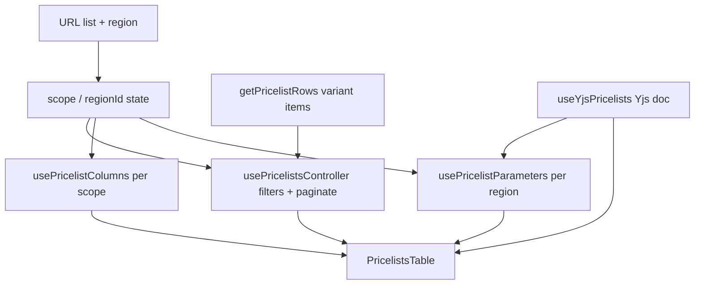

# Store PIM — прайслисты

Страница **Pricelists** (`/store/pim/pricelists`): редактирование закупочных, дилерских и розничных цен в одной таблице **совместно и в реальном времени** (Yjs + WebSocket). Три типа прайслиста (**Global / Supplier / Dealer**), выбор региона, динамические колонки-параметры с формулами, presence-индикаторы соавторов. Данные — **demo** (варианты из каталога + детерминированные seed-значения), но изменения синхронизируются между вкладками/клиентами через collab-сервер.

## Маршруты и навигация

| URL | Поведение |
|-----|-----------|
| `/store/pim/pricelists` | Основная страница прайслистов → `PricelistsPage` |
| `/store/pim/pricelists?list=supplier&region=ru` | Supplier-прайслист по региону Russia (deep link) |

- Маршрут: `app/store/pim/pricelists/page.tsx` → `PricelistsPage`
- Subnav Store: пункт **Pricelists** в каталожной группе (`src/features/store/store-nav.ts`)
- Карточка строки (Name) ведёт на родительский товар варианта (`getCatalogItemDetailHref(row.id, "variants")`)

### Состояние в URL

Из-за `output: "export"` Next-роутер не обновляет `useSearchParams` при клиентском `router.replace`, поэтому страница **сама владеет состоянием** `scope`/`regionId` и синхронизирует URL через History API (`window.history.replaceState`). `popstate` возвращает состояние при навигации назад/вперёд.

| Query-параметр | Константа | Значения |
|----------------|-----------|----------|
| `list` | `SCOPE_QUERY_PARAM` | `supplier` \| `dealer` (для `global` параметр удаляется) |
| `region` | `REGION_QUERY_PARAM` | id региона; присутствует только для supplier/dealer |

## Типы прайслистов (scope)

Переключатель в toolbar — `ToggleGroup` с подсказками-тултипами. Источник правды — состояние страницы (+ URL).

| Scope | Подпись UI | Назначение | Регион | Редактирование цен |
|-------|------------|-----------|--------|--------------------|
| `global` | `Global` | Базовые закупочные цены для всех поставщиков/регионов | нет | да |
| `supplier` | `Supplier` | Закупка + дилер + розница по региону | да | да |
| `dealer` | `Dealer` | Дилер + розница для региона | да | **read-only** |

При смене scope/region пагинация сбрасывается на 1-ю страницу. Регион-селектор показывается только когда `scopeHasRegion(scope)` (т.е. не `global`). Регион по умолчанию — первый в списке (`United Arab Emirates`, валюта `AED`).

## Колонки

Состав и порядок колонок зависят от scope. Колонка `Name` залочена (всегда видима), остальные переключаются в панели **Columns**.

| Scope | Колонки |
|-------|---------|
| `global` | `Name`, `Purchase Price`, `Purchase Price (USD)`, `Dealer Status` |
| `supplier` | `Name`, `Purchase Price`, `Purchase Price (USD)`, `Dealer Price`, `Dealer Price (USD)`, `Dealer Markup`, `Retail Price`, `Retail Price (USD)`, … параметры …, `Retail Markup` |
| `dealer` | `Name`, `Dealer Price`, `Dealer Price (USD)`, `Retail Price`, `Retail Price (USD)`, … параметры …, `Retail Markup` |

Виды колонок (`PricelistColumnKind`): `name`, `editable` (редактируемая цена), `usd` (производная конвертация, read-only, приглушённый цвет), `markup` (производная наценка в %, read-only, приглушённый цвет), `statusSummary` (сводка дилерского статуса), `parameter` (динамическая колонка-параметр).

**Колонки наценки** (`kind: "markup"`, считаются из USD-значений):

| Колонка | Где | База | Наценка |
|---------|-----|------|---------|
| `Dealer Markup` | `supplier` (после `Dealer Price (USD)`) + раскрытие Global-строки по регионам | Purchase Price (USD) | дилерская цена над закупочной |
| `Retail Markup` | `supplier` + `dealer` | Dealer Price (USD) + `Total Expenses` (USD) | розничная цена над посадочной себестоимостью (дилерская + расходы) |

`Retail Markup` помечена `afterParameters: true` — рендерится **после группы параметров** (правее `Total Expenses`) и отделена от неё пунктирным разделителем (`PARAMETER_GROUP_DIVIDER`, такой же как слева от параметров). В панели **Columns** она вынесена в отдельный блок под списком параметров за тем же пунктирным разделителем.

Видимость колонок сохраняется **по scope** в `localStorage`: `store-pricelists-visible-columns:{scope}`. При смене scope hook `usePricelistColumns` перечитывает свой ключ (или дефолты), поэтому настройка живёт отдельно для каждого списка. `hasCustom` подсвечивает кнопку Columns, если набор отличается от дефолтного.

## Цены и валюты

- **Закупочная цена** глобальна для товара (id ячейки без региона: `global:{variantId}:purchase`), дефолтная валюта — `CNY`.
- **Дилерская и розничная** хранятся по товару + региону (`{regionId}:{variantId}:{field}`). Дилерская цена — в `CNY` (валюта поставщика); розничная — в валюте региона (`getDefaultCurrency`: `retail` → валюта региона, остальные → `CNY`).
- **USD-колонки** — производные: `toUsd(amount, currency)` по статичному курсу `CURRENCY_USD_RATE` (зафиксирован как demo-константа, не обновляется в рантайме). Рендерятся приглушённо, без кода валюты.
- **Markup** — производная колонка (тоже приглушённая): наценка дилерской цены над закупочной в процентах, считается из USD-значений (`computeMarkupPercent(purchaseUsd, dealerUsd)`), поэтому валюты сокращаются. `null` (показывается `—`), если закупочная цена пустая или ≤ 0.
- Дефолтные значения детерминированы (`getSeedCellValue(row, field, region)`): чистая функция строки/поля/региона, поэтому все клиенты видят одинаковые значения, пока ячейку не отредактируют. Дилерский seed выводится из закупочного плюс региональная наценка (`getDealerMarkupFactor`, дискретные шаги 10–40%), так что Markup читается как чистый процент и слегка различается по регионам (где-то совпадает).

`buildPriceCellId` намеренно **не зависит от scope** — цена товара общая между прайслистами (например, dealer-цена редактируется и на Supplier-листе, и в раскрытии Global-строки).

## Дилерский статус

`DealerStatus`: `available` (`Available for sale`), `unavailable` (`Unavailable for sale`), `hidden` (`Hidden`). Хранится по товару + региону (`{regionId}:{variantId}:dealerStatus`) в отдельной collab-карте.

- В scope `global` колонка `Dealer Status` — это **сводка**: «Sold in N of M regions» с прогресс-баром (зелёный, если продаётся хотя бы в одном регионе).
- Строки в `global` **раскрываются** (`PricelistsExpandedRegions`): таблица по всем регионам с колонками `Region`, `Dealer Price`, `Dealer Price (USD)`, `Markup`, `Dealer Status`. Дилерская цена редактируема, USD и Markup — производные. Эти ячейки используют те же общие per-region cell-id и тот же канал presence, что и основная таблица.

Дефолтный статус (`getSeedDealerStatus`) детерминирован: у каждого товара свой «уровень доступности» (0..10) от его id, плюс per-region хеш — так каталог покрывает весь диапазон (от «нигде» до «везде»).

## Параметры (динамические колонки)

Параметр — это **динамическая колонка на весь регион**, общая для вкладок Supplier и Dealer (`enabled = scope !== "global"`). Содержит одно базовое значение для всех товаров плюс опциональные per-row переопределения. Значения — числа; единицы измерения живут в подписи (`Customs (USD)`).

Seed-параметры в каждом регионе до появления явного списка в collab-доке: `Customs (USD)`, `Shipping (USD)`, `VAT (%)`, `Total Expenses (USD)`. Значения слегка варьируются по региону (`getSeedParamBase`).

| Возможность | Поведение |
|-------------|-----------|
| Base value | `{regionId}:param:{paramId}:base`, фолбэк — seed |
| Override (по строке) | `{regionId}:param:{paramId}:{rowId}`; `isOverridden` подсвечивает ячейку |
| Reset overrides | `clearParamOverrides` удаляет все переопределения колонки, оставляя base |
| Add / Edit | Диалог `PricelistParameterDialog`: Name, Slug, Formula |
| Reorder | Перетаскивание заголовка (Notion-style swap через pointer-события) |
| Hide/Show | Сохраняется по региону: `store-pricelists-hidden-params:{regionId}` |

**Системная колонка** `Total Expenses` (`SYSTEM_PARAMETER_ID = "total-expenses"`) всегда закреплена **последней**: её нельзя удалить, переставить или вставить колонку после неё. Пользовательские параметры всегда левее (`normalizeParameterDefs`).

### Формулы

В диалоге параметра есть поле **Formula** и блок **Reference** со списком доступных переменных (`FORMULA_VARIABLE_GROUPS`: region status, product, dealer price, retail price) и других параметров региона (по их `slug`). `slug` валидируется паттерном `^[a-z0-9_]+$` и автогенерируется из названия, пока не отредактирован вручную.

> Формула пока **не вычисляется** — выражение хранится для редактора. При сохранении `baseValue` берётся из формулы, только если это конечное число; иначе `0`.

## Совместное редактирование (collab)

Реализовано на **Yjs** + **y-websocket** (`collab/use-yjs-pricelists.ts`). Один общий doc на весь модуль (singleton с подсчётом подписчиков), комната `oryx-pricelists`, адрес из `NEXT_PUBLIC_COLLAB_WS_URL` (по умолчанию `ws://127.0.0.1:1234`).

Shared-карты дока:

| Карта | Содержимое |
|-------|-----------|
| `prices` | `PricelistCellValue` по cell-id |
| `dealerStatuses` | `DealerStatus` по cell-id |
| `parameterDefs` | список `ParameterDef[]` по `regionId` |
| `parameterValues` | числа (base + overrides) по value-id |

**Presence** (awareness): онлайн-пользователи (аватары + статус `Live (n)` / `Offline` в toolbar) и индикаторы «кто сейчас редактирует эту ячейку». Личность — случайная пара прилагательное+животное, цвет и фото-аватар (`i.pravatar.cc`, детерминирован по seed личности), стабильная в пределах вкладки (`sessionStorage`). Если у участника нет `avatarUrl` (старый клиент), аватар деградирует до инициалов на цветном фоне. Параметры тайминга: heartbeat `5s`, устаревание `15s`, debounce editing-presence `100ms`. `connected` отражает только связь с collab-сервером (не BroadcastChannel между вкладками).

## Что видит пользователь

### Шапка (toolbar)

Паттерн [list-page-toolbar.md](../conventions/ui/list-page-toolbar.md). Белый `Card` на `bg-muted/30`, breadcrumb снаружи.

- Заголовок **Pricelists** + подзаголовок «Edit purchase, dealer, and retail prices together in real time.»
- Справа — presence-индикатор соавторов
- Строка управления: переключатель scope, селектор региона (для supplier/dealer), поиск, фильтр по категории, `Filters`, `Columns`, `Export` (кнопка-заглушка без handler)

### Фильтры и пагинация

- Поиск, дерево категорий, бренд, семейство (`PricelistsFiltersSheet`); reset сбрасывает всё
- `PAGE_SIZE` записей на страницу (общая константа каталога), футер с пагинацией (`CatalogFooter`)
- Имитация ответа сервера ~200 ms при смене scope/region/фильтра/страницы (`SERVER_RESPONSE_DELAY_MS`), на это время — скелетон
- Пустой список: «No products match the selected filters.»

## Поток данных



## localStorage / sessionStorage

| Назначение | Ключ |
|------------|------|
| Видимые колонки (per scope) | `store-pricelists-visible-columns:{scope}` |
| Скрытые параметры (per region) | `store-pricelists-hidden-params:{regionId}` |
| Личность соавтора (per tab) | `oryx-pricelists-user` (sessionStorage) |
| Id вкладки (per tab) | `oryx-pricelists-tab-id` (sessionStorage) |

## Структура файлов

```text
app/store/pim/pricelists/page.tsx           # маршрут → PricelistsPage
app/store/pricelists/page.tsx               # заглушка (placeholder)

src/components/store/pim/pricelists/
  pricelists-page.tsx                        # scope/region state, URL sync, сборка
  pricelists-toolbar.tsx                     # scope toggle, region, фильтры, presence, Export
  pricelists-table.tsx                       # таблица, drag-параметры, диалог
  pricelists-expanded-regions.tsx            # раскрытие Global-строки по регионам
  pricelists-presence.tsx                    # аватары + статус Live/Offline

  use-pricelists-controller.ts               # фильтры, пагинация, имитация загрузки
  use-pricelist-columns.ts                   # видимость колонок per scope
  use-pricelist-parameters.ts                # параметры/overrides per region

  pricelists-demo-data.ts                    # scope, регионы, seed-значения, rows
  pricelists-helpers.ts                      # валюты, форматирование, cell-id
  pricelists-columns.ts                      # определения и порядок колонок
  pricelists-parameters.ts                   # ParameterDef, seed, normalize, slug
  pricelist-formula-variables.ts             # переменные для формул
  pricelist-formula-reference*.{tsx,ts}      # справка по синтаксису формул

  pricelist-price-cell.tsx                   # редактируемая ячейка цены
  pricelist-status-cell.tsx                  # селектор дилерского статуса
  pricelist-parameter-*.{tsx}                # ячейка/заголовок/меню/диалог параметра
  pricelists-columns-sheet.tsx               # панель Columns (+ действия с параметрами)
  pricelists-filters-sheet.tsx               # панель Filters

  collab/
    collab-config.ts                          # комната, WS-url, identity, тайминги
    use-yjs-pricelists.ts                     # Yjs doc, карты, awareness/presence
```

## Технические нюансы

- **URL через History API** — следствие `output: "export"`; не использовать `router.replace` для scope/region.
- **Cell-id не зависит от scope** — цены общие между прайслистами и раскрытием Global.
- **Dealer scope read-only** для цен (`isReadOnly = scope === "dealer"`), но параметры там редактируемые (общие с Supplier).
- **Курсы валют статичны** (demo-константа), USD-колонки — производные.
- **collab singleton** делится между подписчиками; на `pagehide` уничтожается, чтобы корректно убрать presence.
- **English UI** для всех подписей; русские строки в UI нарушат `check:ui-english`.
- **Export / formula evaluation** — заглушки (UI готов, логики нет).

## Подключение к бэкенду (план)

1. Заменить `getPricelistRows()`/seed на API товаров и цен; ячейки — те же scope-независимые id.
2. Перенести collab-карты на серверный Yjs-провайдер (или CRDT-бэкенд) с авторизацией по `room`/тенанту.
3. Реализовать вычисление формул параметров (сейчас выражение только хранится).
4. Подключить `Export` к генерации файла прайслиста.

## Локальная проверка

```bash
# collab-сервер (по умолчанию ws://127.0.0.1:1234), напр.:
npx y-websocket
# или задать NEXT_PUBLIC_COLLAB_WS_URL в .env.local

npm run dev
# http://localhost:3000/store/pim/pricelists
# http://localhost:3000/store/pim/pricelists?list=supplier&region=ru

npm run check:ui-english
```

## Связанные материалы

- [AGENTS.md](../../AGENTS.md)
- [store-pim-catalog.md](store-pim-catalog.md) — каталог товаров/вариантов (источник строк)
- [list-page-toolbar.md](../conventions/ui/list-page-toolbar.md) — паттерн toolbar
