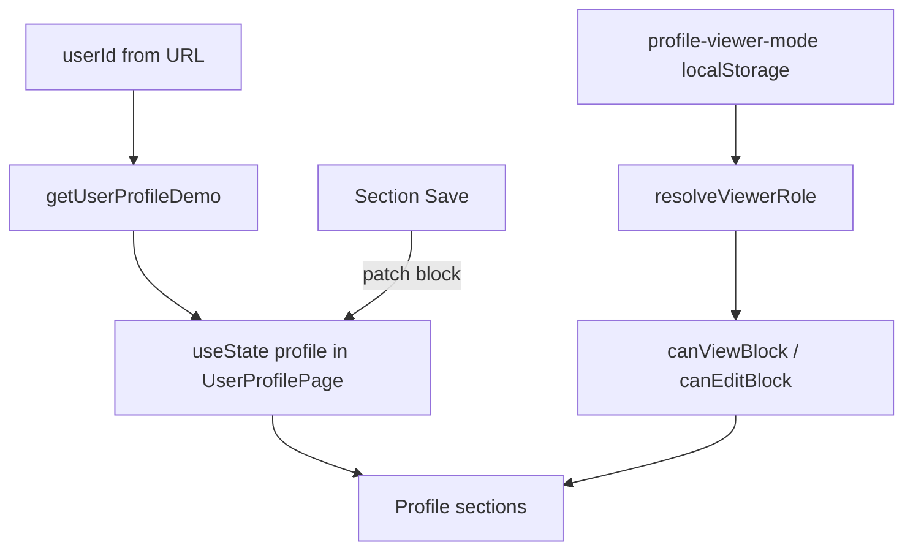

# User profile (`/team/users/[employeeId]`)

Страница профиля сотрудника в модуле **Team**: компактная витрина с мини-формами, разграничением просмотра/редактирования и demo-переключателем контекста. Layout: `app/team/layout.tsx` (`ModuleShell` + Team aside). Данные — **demo в браузере** до перезагрузки (React state, как Thanks).

## Маршруты и навигация

| URL | Назначение |
|-----|------------|
| `/team/users/[employeeId]` | Профиль сотрудника (канонический) |
| `/users/[userId]` | **301** → `/team/users/[userId]` (legacy) |
| `/profile` | **301** → `/team/users/emp-12` |
| `/team/[employeeId]` | **301** → `/team/users/[employeeId]` (legacy) |

- Demo current user id: **`emp-12`** (единый с Pulse Thanks / Company workspace).
- «My profile» в nav-rail, quick-links, Team aside → `/team/users/emp-12`.
- Layout модуля: `app/team/layout.tsx`

## Цели и принципы UX

1. **Компактный, современный, премиальный** — Card-секции на `bg-muted/30`, как [pulse-company-cabinet.md](pulse-company-cabinet.md).
2. **Нет мега-формы** — каждый блок сохраняется отдельно (Save / Cancel в footer секции).
3. **Сложное в модалках** — календарь (отсутствия, шаблон), активы, технические параметры, роли, пароль, оповещения, делегирование.
4. **Расширяемость** — секции через `ProfileSectionId` + `canView` / `canEdit` в `user-profile-permissions.ts`; общие классы в `profile-section-styles.ts`.
5. **Референсы**: `/pulse/company`, `/`, `/store/pim/products` (toolbar/list при необходимости).

## Роли зрителя (viewer context)

Относительно `profileUserId` из URL:

| `viewerRole` | Описание |
|--------------|----------|
| `self` | Смотрю свой профиль |
| `admin` | Администратор |
| `manager` | Руководитель этого сотрудника |
| `other` | Коллега без прав руководителя |

### Demo-переключатели (обязательны на странице)

Card-toolbar под breadcrumb:

**Design version:** **Compact** (v1, плотный/технический) | **Refined** (v2, графичный, спокойный: cover + накладной аватар, единый indigo-акцент, нейтральные карточки).

**Demo viewer:** **As myself** | **As admin** | **As manager** | **As colleague**.

- Design: `oryx:profile-design-version` (`compact` | `graphic`).
- Storage: `oryx:profile-viewer-mode` в `localStorage`.
- Событие: `oryx:profile-viewer-mode-change` (паттерн tenant switcher).
- Hook: `useProfileViewerMode()`.
- **Demo:** выбранный режим — источник истины для роли. **As myself** всегда даёт права `self` (редактирование своих блоков) независимо от того, чей `employeeId` открыт. В production роль берётся из auth/RBAC относительно профиля; переключатель скрывается.

## Deputy vs access delegation

| | **Deputy (substitute)** | **Access delegation** |
|---|-------------------------|------------------------|
| Назначение | Кто замещает при отсутствии; автоназначение задач | Выдача доступа к данным/abilities (напр. табели) |
| Связь с отпуском | Блок **виден только** при статусе **On vacation** | **Не обязана** |
| Кто редактирует | Self | Self, Admin |
| Кто видит | Self, Manager, Admin (когда блок виден) | Self, Manager (view), Admin |

## Матрица доступа по блокам

Обозначения: **V** = view, **E** = edit, **—** = скрыто.

| Блок | Self V | Self E | Manager V | Manager E | Admin V | Admin E | Other V |
|------|--------|--------|-----------|-----------|---------|---------|---------|
| Full name (en/ru/es-MX) | ✓ | ✓ | ✓ | ✓ | ✓ | ✓ | ✓ |
| Avatar | ✓ | ✓ | ✓ | ✓ | ✓ | ✓ | ✓ |
| Work status + optional dates | ✓ | ✓ | ✓ | ✓ | ✓ | ✓ | ✓ |
| Position | ✓ | — | ✓ | — | ✓ | ✓ | ✓ |
| Email, phone, Telegram, WhatsApp | ✓ | ✓* | ✓ | —** | ✓ | ✓ | ✓ |
| Preferred channel | ✓ | ✓ | ✓ | — | ✓ | ✓ | ✓ |
| City, tenure | ✓ | — | ✓ | — | ✓ | ✓ | ✓ |
| Structure (depts, heads, managers, location, district) | ✓ | — | ✓ | — | ✓ | ✓ | summary |
| Test results (stub) | ✓ | — | ✓ | — | ✓ | — | — |
| Calculator (stub) | ✓ | — | ✓ | — | ✓ | — | — |
| Work calendar | ✓ | — | ✓ | ✓ | ✓ | ✓ | — |
| Attendance | ✓ | — | ✓ | — | ✓ | — | — |
| Roles & access | ✓ | — | ✓ | — | ✓ | ✓ | — |
| Personal data | ✓ | ✓ | ✓ | — | ✓ | — | ✓† |
| Hide birth year | ✓ | ✓ | — | — | ✓ | — | — |
| Deputy | ✓‡ | ✓ | ✓‡ | — | ✓‡ | — | — |
| Reports | ✓§ | — | ✓§ | — | ✓§ | — | ✓§ |
| Access delegation | ✓ | ✓ | ✓ | — | ✓ | ✓ | — |
| Assets (3 lists) | ✓ | — | ✓ | assign | ✓ | assign | — |
| Documents | — | — | — | — | ✓ | ✓ | — |
| Technical read-only | — | — | — | — | ✓ | — | — |
| Technical parameters | — | — | — | — | ✓ | ✓ | — |
| Password | ✓ | ✓ | — | — | ✓ | ✓ | — |
| Notification settings | ✓ | ✓ | ✓ | — | ✓ | ✓ | — |

\* Self редактирует контакты; не HR-идентификаторы.  
\** Manager: рабочий контекст — status, calendar, assets; не email/position.  
† Other: personal с учётом **hide birth year** (только day+month).  
‡ Deputy: блок только при **On vacation**.  
§ Reports: если `allowedUserIds` пуст или содержит viewer id.

## Содержимое блоков

### Identity (hero + мини-формы)

- **Full name**: локали `en`, `ru`, `es-MX` (одна активная в форме или табы).
- **Avatar**: upload demo (URL / placeholder).
- **Work status**: `working` | `day_off` | `on_vacation` | `sick_leave` | `off_hours`.
  - Опционально: `workdayStart`, `workdayEnd`, `vacationEnd` (ISO date или datetime demo).
  - Отдельного блока нет: статус — пилюля в шапке, детали графика (`workday`, `vacation ends`) показываются **тултипом** при наведении на пилюлю (`profile-status-tooltip.tsx`).
- **Position**, **Email**, **Phone**, **Telegram**, **WhatsApp**.
- **Preferred channel**: `email` | `telegram` | `whatsapp` | `corporate_messenger` | `phone`.
  - **Contacts** — отдельный блок (`profile-contacts-section.tsx`): кликабельные ссылки (`mailto:`/`tel:`/`t.me`/`wa.me`), предпочтительный канал подсвечен бейджем. Редактирование — в стандартной модалке ShadCN `Dialog` (триггер — кнопка **Edit** в шапке блока).
- **City**.
- **Tenure**: вычисляется от `hireDate` (admin technical); отображение «X years Y months».

### Structure

- `departments[]`, `headOfDepartments[]`, `managers[]`, `location`, `district`.
- Edit: Admin (modal **Edit structure**).

### Test results (stub)

- Таблица ~50 строк: section, test name, dates, score, status (fake).

### Calculator (stub)

- Placeholder «Calculator» — large card, no logic.

### Work calendar

- Месячная сетка (demo: March 2026).
- Кнопки (Manager, Admin): **Absences**, **Schedule template** → Dialog.

### Attendance

- Список записей: date, check-in, check-out, location/note.

### Roles & access

- **Tenant roles**: `{ tenantId, tenantName, roles[] }` — минимум `User` per tenant.
- **Instance roles**: сквозные (напр. `Tasks Support`).
- **Abilities**: deduped union по всем ролям, grouped by `moduleId`.
- Admin: **Manage roles** → Dialog.

### Personal

- Gender, age (derived), birthday, hobbies, sports, music artists, favorite movie, favorite book.
- **hideBirthYear**: checkbox; others see `DD Mon` only.

### Reports

- Как company cabinet: `ReportLinkCard` grid.
- Фильтр: `showInProfile`, `tenantIds`, `allowedUserIds`.

### Access delegation

- Список делегатов (employee pickers) + ability scope (demo checkboxes).
- Modal **Manage delegation**.

### Assets

1. **Assigned (pinned)** — категории **всегда** в UI (пустые категории видны).
2. **Registrant** — flat list.
3. **Materially responsible** — flat list.
- Admin/Manager: **Assign asset** → Dialog.

### Documents (admin only)

Категории: `offer`, `nda`, `material_liability`, `exit_checklist`, `scans`, `other`. Upload/delete в модалке.

### Technical (admin only, read-only)

- `createdAt`, `updatedAt`.

### Technical parameters (admin, modal)

- Main tenant, Bitrix ID, 1C ID, Anviz ID, hire date, job role type, position, departments[], SNILS.

### Password

- **User**: current + new + confirm + strength meter; **Reset via email** (toast).
- **Admin**: new + confirm без current; **Reset via email**.

### Notification settings

- По модулям (`Pulse`, `Tasks`, `Store`, …); каналы **Email** и **Portal** (toggles).

## Компоновка страницы

```
Breadcrumb
Demo viewer switcher (Card)
Profile hero (identity summary)
Reports (full width)
[Structure | Contacts] grid
[Calendar | Attendance] grid
[Roles | Personal] grid
[Assets | Delegation] grid
[Test results stub]
[Calculator stub]
[Documents | Technical] — admin only row
Modals (portal)
```

## Поток данных (demo)



## Чеклист покрытия ТЗ

| # | Требование | Раздел |
|---|------------|--------|
| 1 | 3 способа редактирования (admin/manager/self) | Матрица |
| 2 | Разный объём просмотра | Матрица + Other |
| 3 | Компактный премиальный дизайн | Цели |
| 4 | Мини-формы, отдельный save | Цели |
| 5 | Модалки для сложного | Цели, блоки |
| 6 | Расширяемость | Цели, файлы |
| 7 | Demo switcher 4 режима | Demo-переключатель |
| 8 | Данные не persist после reload | Введение |
| 9 | ФИО 3 языка | Identity |
| 10 | Аватар | Identity |
| 11 | Рабочий статус + даты | Identity |
| 12 | Должность | Identity / Technical |
| 13–16 | Почта, телефон, TG, WA | Identity |
| 17 | Предпочитаемый канал | Identity |
| 18 | Город | Identity |
| 19 | Стаж | Identity |
| 20 | Структура (все поля) | Structure |
| 21 | Тесты stub 50 строк | Test results |
| 22 | Калькулятор stub | Calculator |
| 23 | Календарь + Absences/Template | Work calendar |
| 24 | Посещаемость self+manager | Attendance |
| 25 | Роли по tenant + instance | Roles |
| 26 | Abilities по модулям | Roles |
| 27 | Личные данные | Personal |
| 28 | Скрыть год рождения | Personal |
| 29 | Заместитель при отпуске | Deputy |
| 30 | Отчёты | Reports |
| 31 | Делегирование доступа | Access delegation |
| 32 | Активы 3 списка + категории | Assets |
| 33 | Документы admin-only | Documents |
| 34 | Technical dates | Technical |
| 35 | Technical parameters | Technical parameters |
| 36 | Пароль user vs admin | Password |
| 37 | Сброс пароля на почту | Password |
| 38 | Оповещения по модулям/каналам | Notifications |

## Файлы

| Файл | Роль |
|------|------|
| `app/team/users/[employeeId]/page.tsx` | Route (в layout Team) |
| `app/users/[userId]/page.tsx` | Legacy redirect |
| `src/features/users/profile/user-profile-page.tsx` | Оркестратор + state |
| `user-profile-demo-data.ts` | Типы, seed, reports, assets |
| `user-profile-permissions.ts` | `canViewBlock`, `canEditBlock` |
| `use-profile-viewer-mode.ts` | Demo switcher |
| `profile-section-card.tsx` | Оболочка секции |
| `profile-toolbar.tsx` | Design version + demo viewer |
| `user-profile-page-v1.tsx` | Compact (technical) layout |
| `user-profile-page-v2.tsx` | Refined (graphic) layout |
| `use-profile-design-version.ts` | Design version localStorage |
| `sections/*.tsx` | Блоки UI |
| `modals/*.tsx` | Dialogs |

## TODO (после demo)

- Auth/RBAC вместо demo switcher
- API persist, file upload
- Реальный калькулятор и интеграция тестов
- Унификация employee directory с `/users/[id]`

## Open questions (defaults in demo)

- Manager не редактирует position/email — только status, calendar, assets.
- Access delegation: manager view-only для подчинённых.
